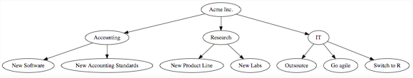

# function plot()

## What it is?
- x와 y축을 가지고 점을 찍듯 그래프를 그리는 함수
- 산점도를 간편하게 그릴 수 있다.
- 점을 찍는 함수이기 때문에, 점이 모이면 선이 되기에, 선형 그래프도 가능
- 또한, 범용적으로 사용이 가능한 **generic function**이기 때문에, 입력되는 데이터의 타입과 클래스에 따라 성격에 맞게 다양한 시각화 결과물을 제공

## How to use
- Syntax form
```R
plot(x:required, y:required, type="{type}":optional)
```

- 하나의 좌표 찍기
```R
plot(2,1)
```

- 복수의 좌표 찍기
```R
>plot(c(2,1), c(1,5))
```

- 산점도 만들기
```R
names(cars) # [1] "speed" "dist"
plot(cars$speed, cars$dist) # same as plot(dist ~ speed, data=cars)
```
내장 객체 cars에서 speed 정보를 담은 벡터 cars$speed가 x축으로,  
cars에서 dist 정보를 담은 벡터 cars$dist가 y축으로 입력됨으로써  
차량의 속도와 거리간의 관계를 대략적으로 살펴볼 수 있는 산점도를 볼 수 있게 된다.

- **type**인자 활용하기
    * 그래프를 어떻게 그릴 것인지 묻는 param으로서 default는 point인 "p"이다.
```R
plot(c(1,2), c(1,5), type="p") # same as plot(c(1,2), c(1,5))
```
|값   |설명   |
|---|---|
|p   |point   |
|l   |line   |
|b   |both point and line   |
|o   |both point and line but overplotted)   |
|h   |histogram   |
|s   |stair steps   |
|S   |upper stair steps   |
|n   |no coordinate   |  
※ type="n"은 경우 plot의 토대인 축은 표현되나, 좌표가 찍히지 않음으로써 그림을 그리기 직전 준비 상태와 비슷

- 이외의 다양한 인자들
    * plot 함수는 그래픽스 파라미터 **par**을 상속받게 되어 다양한 인자들을 사용할 수 있는데, 이를 이용하여 좀더 세부 조정이 가능하다.
```R
?par # par에 대한 help script 조회

# cex: 좌표 포인트의 크기 조정
plot(dist ~ speed, data=cars, cex=2) # default는 cex=1, 즉 2배 크게
plot(dist ~ speed, data=cars, cex=.5) # default는 cex=1, 즉 2배 작게

# fg: 축의 색상 변경
plot(dist ~ speed, data=cars, fg="blue")

# lty: line 타입일 때, 라인의 스타일을 변경
plot(dist ~ speed, data=cars, type="l", lty="dashed")

# pch: point 타입일 때, 라인의 스타일을 변경
plot(dist ~ speed, data=cars, type="p", pch=3) # pch는 1 ~ 25 개의 모양 선택 가능
```

## Why plot is generic function
```R
library(data.tree)
data(acme, package="data.tree")
plot(acme) #output below
```

- data.tree라는 패키지가 있고, 이 패키지에 포함되어 있는 *acme*는 class가 _data.tree_ 구조를 가지고 있는 데이터셋이다.  
이를 *plot()*함수에 입력하여 plotting하면 우리가 기존에 알고 있던 plot의 결과물이 아닌 새로운 시각화 결과물이 나온다.
- 이러한 이유는, *plot()*이란 함수는 입력되는 데이터의 class에 알맞게 최적으로 표현해줄 수 있는 방법의 코드로 실행되기 때문이며  
이러한 특징을 갖는 함수를 R에서는 **generic function**이라고 부른다.


