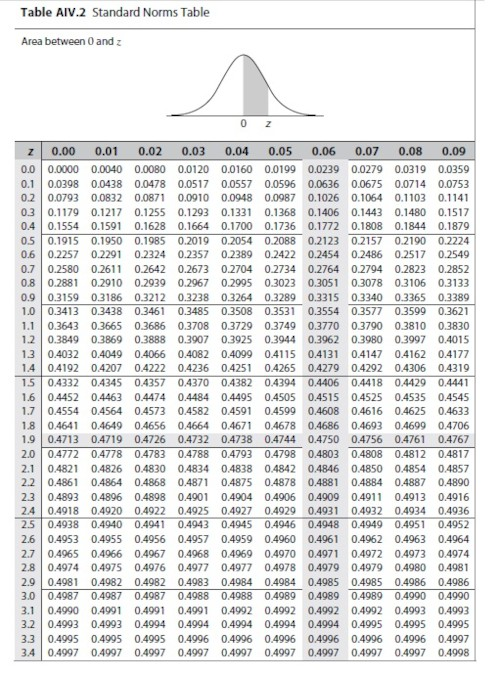

Normal Distribution
===================
## Description
{:width="25%" height="25%"}  
- 가우스가 처음 정립했기 때문에 가우스 분포(Gaussian distribution)라고도 한다.
- 통계학에서 사용하는 각종 확률 분포 중에서도 가장 중요하게 다루는 분포.
- 정규분포는 특정값의 출현비율을 그렸을 때, 중심(평균값)을 기준으로 좌우 대칭 형태가 나타나며, 좌우 극단으로 갈수록 급격하게 수치가 낮아지는 특징이 있다.
- 그래서 **변곡점**도 2개가 있는데, 모두 평균에서 표준 편차만큼 떨어져 있다. 변곡점: 어떤 함수의 증감 추세가 바뀌는 점을 말한다.
- 본래 자연과학의 도구로 출발하였으나 사회학, 심리학의 실험 통계에서도 정규분포가 사용된다.예로, 빈부격차 수준과 같은 거시적인 대상을 설명할 때 특히 중요하게 다뤄진다.
- 정규분포가 아닌 자료를 비율에 맞추어 정규분포로 나타내는 것을 **표준화(standardization)**라고 한다. 자료의 백분위 p만을 뽑아내서, 그 백분위에 대응되는 정규분포의 값을 _z값_, _표준화된 값_, 혹은 _표준점수_라 부르는 것이다.  
- ex) 성적표
>9등급 성적표  
    * 원점수가 전체 중 상위 몇 %인지 - 백분위  
    * 백분위 대응되는 평균 100, 표준편차 20의 정규분포값 - 표준점수  
    * 표준점수의 범위 - 등급  
> 내신 등급으로 전교등수 대략적인 추정하기(원점수의 전체평균과 표준편차가 알려져 있고, 워점수의 분포가 정규분포와 비슷하다는 전제)  
    * 표준점수: 20 * ({original score}-{mean})/{standard deviation} + 100  
    * 백분위: ({original score}-{mean})/{standard deviation}의 값이 양수라면 정규분포표로 그 값에 해당하는 확률을 구한 후 0.5에서 빼고 100을 곱한다. 음수라면 0.5에 그 값을 더하고 100을 곱한다.  
    * 전교등수: ({전교생 수}*{백분위})/100  
    -> 원점수 90, 평균 60, 표준편차 20인 성적표가 있다. 이 학생의 표준점수는 20 * (90 - 60)/20 + 100으로 130점이고, 이를 표준화하면 1.5이다. 1.5의 표준정규분포의 값은 표준 정규 분표 테이블에 의해 0.4332이므로 이 학생의 백분위는 0.5 - 0.4332 = 0.067이다. 따라서 대략 상위 6.7%(백분위 93.3%)이므로 이 학생의 성적 등급은 2등급일 가능성이 크다.  

## R Practice
**pnorm** - 정규분포 넓이. 즉, 확률(percentage)  
**qnorm** - 정규분포 x value  
**dnorm** - 정규분포 y value
**rnorm** - 정규분포를 따르는 난수를 생성  

- 정규분포에서 평균(mean)이 80이고 표준 편차(standard deviation)가 10인 그래프
```R
# x축의 범위 지정 및 300개의 단위로 쪼갬
x <- seq(40, 120, length=300)
x
# y축의 범위 지정 및 300개의 단위로 쪼갬
y <- dnorm(x, mean=80, sd=10)
y
# plot: x와 y축을 가지고 점을 찍듯 그래프를 그리는 함수
plot(x, y, type="l", col="green")
# 다른 선 그래프를 추가
lines(x, dnorm(x, mean=80, sd=20), col="blue")
```
※[How to use plot](./func-plot.md)

- probability between 65~75
```R
x2 <- seq(65, 75, length=200)
y2 <- dnorm(x2, mean=80, sd=10)
polygon(c(65, x2, 75), c(0, y2, 0), col="gray") #다각형을 그리는 함수

pnorm(75, mean=80, sd=10) - pnorm(65, mean=80, sd=10)
```
- probability less than 92
```R
pnorm(92, mean=80, sd=10, lower.tail=TRUE) # same as pnorm(92, mean=80, sd=10)
```
- probability over 92
```R
pnorm(92, mean=80, sd=10, lower.tail=FALSE) # same as 1-pnorm(92, mean=80, sd=10)
```
- cutoff that seperates the bottom 30
```R
qnorm(0.30, mean=80, sd=10)
```
- cutoff that contains the middle 60
```R
qnorm(0.8, mean=80, sd=10)
qnorm(0.2, mean=80, sd=10)
#위의 두 지점 값의 사이가 중간 60 구간
#검증방법 중간 값인 평균 80으로부터 마이너스를 해보고 좌우 마이너스 값이 같다면 ok
80-qnorm(0.8, mean=80, sd=10) # -8.41
80-qnorm(0.2, mean=80, sd=10) # 8.41
```