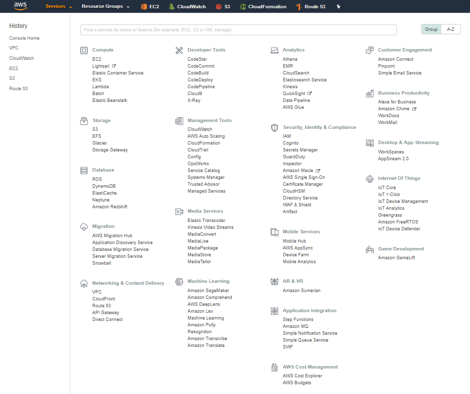

AWS terminology
===

|   |Traditional Infra   |AWS   |
|---|---|---|
|   |Network   |VPC(Virtual Private Cloud)   |
|   |Security Policy   |Security Group   |
|   |L4   |ELB(Elastic Load Balancer)   |
|   |Server   |EC2(Elastic Computing in Cloud)   |
|   |DNS   |Route53   |
|   |Database   |RDS(Relational Database Service)   |
|   |Storage   |S3   |
|   |CDN   |CloudFront   |
|   |NAT   |NAT   |
|   |Release System   |OpsWorks   |
|   |System Disaster Alert   |SNS   |
|   |Server Access   |VPN   |

1. Computing
EC2 - Elastic Computing in Cloud. Server
Lambda
Auto Scailing - 서버 자동 증설

2. Database
RDS - 관계형 데이터 베이스

3. Network
VPC - Virtual Private Cloud. Network
Route53 - DNS
ELB - Elastic Load Balancer
Direct Connect - 데이터 전용선

4. Storage
S3 - Simple Storage
EBS - Elastic Block Store
Glacier - 저사양 저장소
CloudFront - CDN

5. Security
Security Group - Firewall
IAM - Identity and Access Management about aws user
CloudWatch - Mornitoring
CloudTrail - API call record

