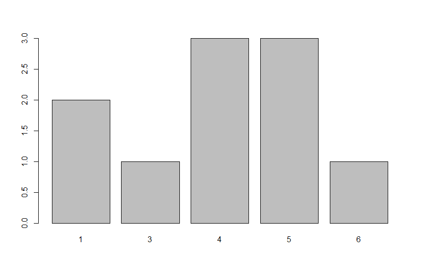
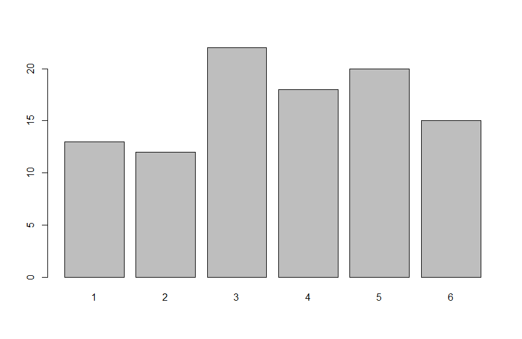
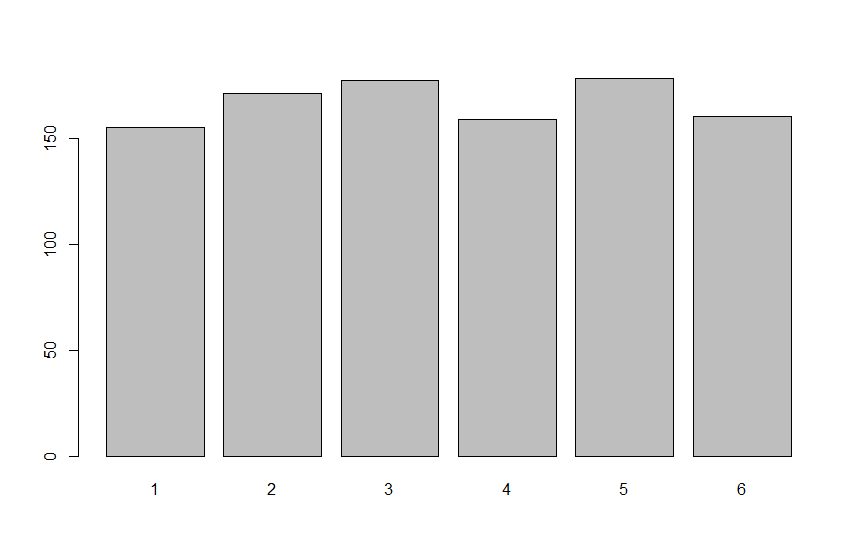
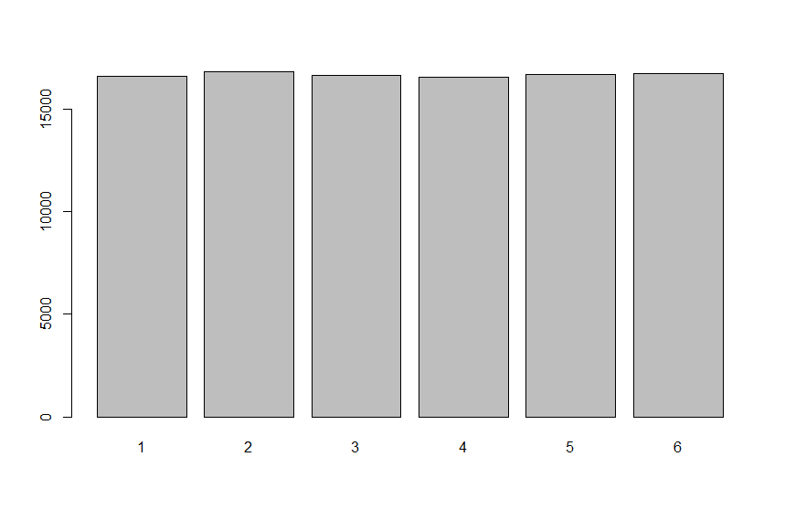

uniform distribution simulate
==================================
```R
DICE_FACE <- 6 # face number of dice
ROLL_COUNT <- 10 # roll count of dice

# runif(ROLL_COUNT) # 100 random numbers
die <- ceiling(runif(ROLL_COUNT)*DICE_FACE) # ceiling built-in function: round-up

dataSet <- table(die) # table: data 값을 column으로 만들고 그 수의 집계량을 column value로서 지정하여 table를 만들어준다.
barplot(dataSet) # barplot: visualize bar plot
```

roll the dice 10 times


roll the dice 100 times


roll the dice 1000 times


roll the dice 100000 times


=> 데이터의 집계량이 높아질 수록 수학적 확률 계산(n/6)의 값에 수렴하고 있다.
