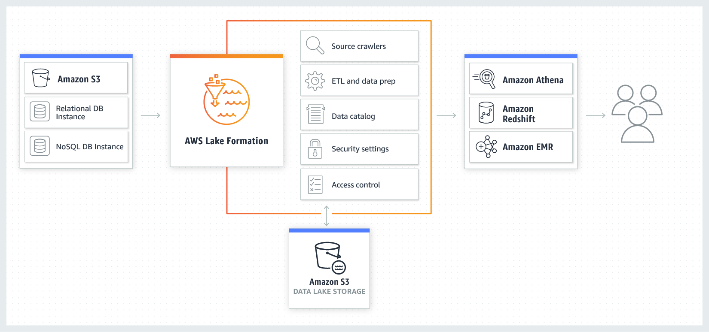

Data Lakes and Analytics on AWS
===

## Data Movement
- On-premises data movement  
    -> To establish a dedicated network connection between your network and AWS, you can use __AWS Direct Connect__.  
    -> To move petabytes to exabytes of data to AWS using physical appliances, you can use __AWS Snowball__ and __AWS Snowmobile__.  
    -> To have your on-premises applications store data directly into AWS, you can use __AWS Storage Gateway__  
- Real-time data movement  
    -> To make it simple to capture and load streaming data or IoT device data, you can use __Amazon Kinesis Data Firehose__, __Amazon Kinesis Video Streams__, and __AWS IoT Core__.  

## Data Lake
__Data Lake__: A data lake is a centralized, curated, and secured repository taht stores all your dat, both in its original form and prepared for analysis. A data lake enables you to break down data silos and combine different types of analytics to gain insights and guide better business decisions.    

However, setting up and managing data lakes today involves a lot of manual, complicated, and time-consuming tasks. This work includes loading data form diverse sources, mornitoring those data flows, setting up partitions, turning on encryption their operation, reorganizing data into a columnar format, configuring access control settings, deduplicating redundant data, matching linked records, granting access to data sets, and auditing accesss over time.  

- Object Storage  
    -> S3: secure highly scalable, durable object storage with millisecond latency for data access. S3 is built to store any type of data from anywhere - web sites and mobile apps, corporate applications and data from IoT sensors or devices. S3 Select focuses data read and retrieval, reducing response times up to 400%.  
- Backup and Archive   
    -> Glacier: secure, durable and extremely low cost storage for long-term backup and archive that can access data in minutes. Customers can store data for as little as $0.004 per gigabyte per month.  
- Data Catalog  
    -> To make it easy for end users to discover the relevant data to use in their analysis, __AWS Glue__ automatically creates a single catalog that is searchable, and queryable by users.  
    -> Glue : Fully managed service that provides a data catalog to make data in the data lake discoverable, and has the ability to do extract, transform, and load(ETL) to prepare data for analysis. The data catalog is automatically created as a persistent metadata store for all data assets, making all of the data searchable, and queryable in a single view.  
- __AWS Lake Formation__  
    -> To build a secure data lake faster, you can use __AWS Lake Formation__.  
    -> Creating a data lake with Lake Formation is as simple as defining where your data resides and what data access and security policies you want to apply. Lake Formation then collects and catalogs data from databases and object storage, moves the dat into your new S3 data lake, cleans and classifies data using machine learning algorithms, and secures access to your sensitive data. Your users can then access a centralized catalog of data which describes available data sets and their appropriate usage. Your users then leverage these data sets with their choice of analytics and machine learning services, like Amazone EMR for Apache Spark, Amazone Redshift, Amazone Athena, Amazone Sagemaker, and Amazone QuickSight.  
    -> Benefits  
        -> Build data lakes quickly  
        -> Simplify security management  
        -> Make self-service access to data both easy and secure  

## Lake Formation, How it works
  
Lake Formation helps to build, secure, and manage your data lake.   
First, identify existing data stores in S3 or relational and NoSQL databases, and move the data into your data lake. Then crawl, catalog, and prepare the data for analytics. Then provide your users secure self-service access to the data through their choice of analytics services. Other AWS services and third-party applications can also access data through the services shown. Lake Formation manages all of the tasks in the orange box and is integrated with the data stores and services shown in the blue boxes.  

## Analytics
- Interactive Analytics: __Amazon Athena__  
    -> For interactive analysis, Amazon Athena makes it easier to analyze data directly in S3 and Glacier using standard SQL queries.  
    -> Athena is serverless, so there s no infrastructure to setup or manage.  
    -> You can start querying data instantly, get results in seconds and pay only for the quries that you run.  
    -> Simple point to your data in S3, define the schema, and start querying using standard SQL. Most results are delivered within seconds.  
- Big Data ProcessingL __Amazon EMR__  
    -> For big data processing using the Spark and Hadoop frameworks, Amazon EMR provides a managed service that makes it easy, fast, and cost-effective to process vast amounts data.  
    -> Supports 19 different open-source projects including Hadoop, Spark, HBase, and Presto, with managed EMR Notebooks for data engineering, data science development, and collaboration.  
- Data Warehousing: __Amazon Redshift__  
    -> For data warehousing, Amazon Redshift provides the ability to run complex, analytic queries against petabytes of structured data, and includes Redshift Spectrum that runs SQL queries directly against Exabytes of structured or unstrunctured data in S3 without the need for unnecessary data movement.  
- Real-Time Analytics: __Amazon Kinesis__  
    -> For real-time analytics, Amazon Kinesis makes it easy to collect, process and analyze streaming data such as IoT telemetry dat, application logs, and website clickstreams.  
    -> This enable you to process, and analyze data as it arrives in your data lake, and respond in real-time instead of having to wait until all your data is collected before the processing can begin.  
- Operational Analytics: __Amazon Elasticsearch Service__  
    -> For operational analytics such as application mornitoring, log analytics and clickstream analytics, __Amazon Elasticsearch Service__ allows you to search, explore, filter, aggregate, and visualize your data in near real-time.   
    -> Amazon Elasticsearch Service delivers Elasticsearch's easy-to-use APIs and real-time analytics capabilities alongside the availability, scalability, and security that production workloads require.  
- Dashboards and Visualizations: __Amazon QuickSight__  
    -> For dashboards and visualizations, Amazon QuickSight provides you a fast, cloud-powered business analytics service, that makes it easy to build stunning visualizations and rich dashboards that can be accessed from any browser or mobile device.  

## Machine Learning
- Frameworks and Interfaces: __AWS Deep Learning AMIs__  
    -> For expert machine learning practitioners and data scientists, AWS provides AWS Deep Learning AMIs that make it easy to build deep learning models, and build clusters with ML and DL optimized GPU instances.  
    -> AWS supports all the major machine learning frameworks, including Apache MXNet, TensorFlow, and Caffe2 so that you can bring or develop any model you choose.  
- Platform Services: __Amazon SageMaker__   
    -> For developers who want to get deep with ML, Amazon SageMaker is a platform service that makes the entire process of building, training, and deploying ML models easy by providing everything you need to connect to your training data, select, and optimize the best algorithm and framework, and deploy your model on auto-scaling clusters of Amazon EC2.  
    -> SageMaker also includes hosted Jupyter notebooks that make it is easy to explore, and visualize your training data stored in S3.  
- Application Services:  
    -> For developers who want to plug-in pre-built AI functionality into their apps, AWS provides solution-oriented APIs for computer vision, and natural language processing.  
    -> These application services lets developers add intelligence to their applications without developing and training their own models.  