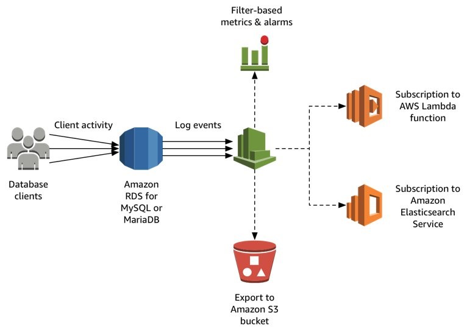

Mornitor Amazon Aurora MySQL, RDS for MySQL and MariaDB logs with CloudWatch
===
[Reference LINK](https://aws.amazon.com/ko/blogs/database/monitor-amazon-rds-for-mysql-and-mariadb-logs-with-amazon-cloudwatch/)

## Nea-real time insights into DB instance logs
- Setting alarms on abnormal conditions, such as unusually high volumes of slow queries or failed connection attempts
- Correlating logs with other application logs
- Retaining logs for specific security and compliance purposes
- Analyzing trends in log data over time

## Log export concepts
MySQL과 MariaDB를 위해 다음과 같은 logs types를 지원
- `Error log` : contains diagnostic messages generated by the database engine, along with startup and shutdown times.
- `General query log` : contains a record of all SQL statements received from clients, and also client connect and disconnect times.
- `Slow query log` : contains a record of SQL statement that took longer to execute than a set amount of time and that examined more than a defined number of rows. Both thresholds are configurable.
- `Audit log` : provided by using the MariaDB Audit Plugin, this log records database activity on the server for audit purpose. Refer to the [Aurora MySQL documentation](https://docs.aws.amazon.com/AmazonRDS/latest/UserGuide/AuroraMySQL.Auditing.html) for more info.

Log events from these sources are published in the form of _log streams_(sequences of log events) to _log groups_ in Amazon CloudWatch. Each DB instance and log type creates a seperate group in the same AWS Region as the DB instance, with the following naming pattern:
> /aws/rds/instance/\<db-instance-id\>/\<log-type\>

Your log data is durably stored in CloudWatch Logs and encrypted at rest. However, your logs might contiain sensitive info -configuration and data- for which access should be restricted to appropriate users in your account. Therefore, it is important to configure [appropriate IAM access policies](https://docs.aws.amazon.com/AmazonCloudWatch/latest/logs/iam-access-control-overview-cwl.html) for the log groups containing database logs.

Amazon RDS publishes logs from your DB instances to log groups in the same account as the DB instances using a [service-linked role](https://docs.aws.amazon.com/IAM/latest/UserGuide/using-service-linked-roles.html), which permits Amazon RDS to access to the relavant log groups in your account. After enabling log publication, you might see an additional IAM role named `AWSServiceRoleForRDS` in your account.

## Prerequisites for log publication
Depending on the log types that you want to track and publish, you might need to take a few prerequisite steps:
- `error log` : enabled by default. You don't need to perform any additional actions to work with it.
- `audit log` : enabled by adding and configuring the MariaDB Audit Plugin for both MySQL and MariaDB instances.  
    ※ [How to create a custom option group with these settings for AWS RDS and MariaDB](https://docs.aws.amazon.com/AmazonRDS/latest/UserGuide/Appendix.MySQL.Options.AuditPlugin.html)  
    ※ [How to create a custom option group with these settings for Aurora MySQL](https://docs.aws.amazon.com/AmazonRDS/latest/UserGuide/AuroraMySQL.Auditing.html)  
- `general and sloq query log` : enabled by specific database engine parameters.  
    ※ If you don't already use a custom [DB cluster parameter group](https://docs.aws.amazon.com/AmazonRDS/latest/UserGuide/Aurora.Managing.html#Aurora.Managing.ParameterGroups) for Aurora MySQL or [DB paramter group](https://docs.aws.amazon.com/AmazonRDS/latest/UserGuide/USER_WorkingWithParamGroups.html) for RDS for MySQL and MariaDB to tune the configuration of your DB instance, you might have to [customize the following paramters](https://docs.aws.amazon.com/AmazonRDS/latest/UserGuide/USER_LogAccess.Concepts.MySQL.html):  
    - Set `slow_query_log = 1` to enable the slow query log  
      ※ Additional parameters to help you tune which statements get reported in the log. [MySQL](https://dev.mysql.com/doc/refman/5.7/en/slow-query-log.html) or [MariaDB](https://mariadb.com/kb/en/library/slow-query-log-overview/)
    - Set `general_log = 1` to enable the general log  
      ※ As preceding, check the [MySQL](https://dev.mysql.com/doc/refman/5.7/en/query-log.html) or [MariaDB](https://mariadb.com/kb/en/library/general-query-log/) docs for additional tuning parameters.
    - Set `log_output = FILE` to write logs to the file system and publish them to CloudWatch Logs

**Note** : PROD DB instance에서 audit log와 general log를 활성화 시킬 때 주의!  
이 log들은 실행되는 모든 statement를 capture하고 record하기 때문에, 이러한 움직임은 DB instance의 performance degradation을 초래할 수 있음.  

## Creating a DB instance with log exports
새로운 DB instance와 기존 DB instance에서도 log exports를 설절할 수 있음.  
