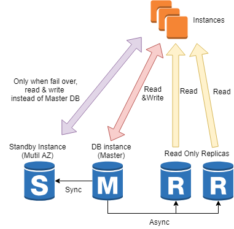

RDS: Relational Database Service
===

## RI(Reserved Instance)
Light: good for short term development 
Medium: good for 24/7 running but it has fluctuation
Heavy: good for 24/7 heavy running like prodction

Multi-AZ Deployment: 장애에 자동으로 대처하는 Failover 기능을 위한 Multi AZ 복제 옵션
DB Instance Identifier: DB 인스턴스의 이름. 같은 REGION내 중복 불가
Parmeter Group: MySQL을 실행할 때 필요한 매개변수 집합. DB 인스턴스 생성 후 Parameter Group 추가 가능(my.cnf 파일을 생성하는 것과 동일)
Backup: 자동 백업 옵션. 원하는 시점으로 데이터를 복구할 수 있는 PIT(Point In Time)복구 사용 가능. PIT 복구는 최근 5분 전 상태로 되돌릴 수 있으며 1초 단위로 설정 가능
Backup Retention Period: 백업 데이터 유지 기간. 최장 35일까지.

Backup Window와 Maintenance Window는 Duration을 서로 지정하여 서로 작업 시간이 겹치지 않도록 해야 함.
Maintenance Window의 설정 시간에 Auto Minor Version Upgrade를 설정했다면 DB 버전 업데이트 또는 패치가 적용됨. 
DB 버전 업데이트 또는 패치는 필수적인 것(보안 패치)만 적용됨. DB 업데이트 또는 패치가 적용되는 시간 동안에는 DB 인스턴스의 실행이 중지됨.
DB 인스턴스 클래스를 변경했다면, 이 시간에 적용. 인스턴스 클래스가 변경되는 동안 DB 인스턴스의 실행이 중지됨.

## Multi-AZ 복제와 Failover
Multi-AZ 복제를 사용했을 때는 Standby 인스턴스에서 백업을 진행하게 되므로 메인 인스턴스의 I/O 성능에 영향 없음.
Failover: Multi-AZ 복제를 사용하도록 설정 뒤, 메인 DB 인스턴스에 장애(AZ 장애, 인스턴스 중단, 네트워크 장애, 스토리지 장애)가 발생하면 자동으로 Standby 인스턴스가 메인 인스턴스로 승격.
Failover downtime 3~6 minutes
Failover 기능이 동작하면 Endpoint 주소가 가리키는 DB 인스턴스가 메인 인스턴스에서 standby 인스턴스로 바뀌므로 Endpoint를 사용하는 측에서는 Failover를 위해 따로 설정해줄 필요가 없음.

## RDS DB 인스턴스 STOP
EC2와 달리 RDS DB 인스턴스는 정지 개념이 없으며, Delete를 해야한다. 단, DB 인스턴스를 삭제할 때는 Final DB Snapshot을 생성할 수 있어, Final DB Snapshot으로 다시 DB 인스턴스를 생성하여 이전 데이터 그대로 시작 가능.

## Security Group
DB 생성시 default(VPC) Security Group를 설정하였다면, 외부로부터의 DB 접속은 불가. DB 인스턴스 전용 Security Group을 생성할 필요가 있음. 
※ default(VPC) Security Group: Inboud가 모든 traffic에 대하여 열려 있지만, 오직 같은 VPC 내부로 한정되어 있는 방화벽 설정이다.
Port의 경우 MySQL - 3306, Oracle - 1521, PostgreSQL - 5432

## Snapshot
EBS와 마찬가지로 RDS도 Snapshot을 생성할 수 있다. RDS DB의 스냅샷은 DB의 전체 내용 중 특정 시점을 파일로 저장한 형태.
DB Automatic Backup: RDS DB 인스턴스를 삭제하면 DB auto bacup도 함께 삭제됨
DB Snapshot: RDS DB 인스턴스를 삭제하더라도 DB 스냅샷은 계속 유지되며 다른 Region으로 복사 가능.
Multi-AZ를 사용 중에 있다면, DB Snapshot은 standby 인스턴스에서 스냅샷을 생성하기 때문에 메인 인스턴스의 I/O에 영향 없음.

## DB Automatic Backups
인스턴스를 생성할 떄, Enable Automatic Backups를 설정했다면 특정 시점으로 RDS DB 인스턴스 생성 가능. 이때 이미 있는 DB 인스턴스를 rollback하는 것이 아닌, 특정 시점의 내용으로 DB 인스턴스를 새롭게 생성하는 방식.

## Multi-AZ 복제와 Read Replica
Multi-AZ 복제: 쓰기 작업을 실시한 즉시 예비 인스턴스에 복제됨. 따라서 데이터가 항상 일치한다는 것을 보장할 수 있음. Multi-AZ 복제는 서비스가 항상 가동해야 하는 가용성(Availability)을 위한 것이지 부하 분산을 통한 성능 향상을 위한 것이 아님. 또한 예비 인스턴스에서는 읽기 작업 불가.
Read Replica: 쓰기 작업을 실시하면 약간의 시간차를 가지고 복제됨. 따라서 데이터가 항상 일치한다고 보장할 수는 없음. 읽기 부하 분산을 통해 성능 향상 도모. 메인 DB 인스턴스처럼 각각 엔드포인트를 가지고 있기 때문에 주소로 접근이 가능하지만 INSERT, UPDATE, DELETE와 같은 Write작업을 할 수 없다.

## Promote Read Replica
Read Replica 인스턴스를 새로운 Master DB instance로 승격(Promote)시키는 기능. 
이 기능을 사용하면 이전 Master DB와의 복제 관계는 끊어지고, 별개의 DB 인스턴스가 됨.
이 기능을 위해서는 먼저 Enable Automatic Backups, Backup Retention Period, Backup Window를 설정해야 한다.

## RDS DB Scale up(Verical Scaling)
DB instance class 변경: vCPU, Memory, Network 성능 향상
Allocated Storage 용량 확장: 최대 3072GB(3TB)까지
    Read Replica가 있는 DB 인스턴의 경우, Read Replica의 Storage 용량도 동일한 값으로 증가시켜야 한다.
Provisioned IOPS 변경: Storage 용량이 100GB 이상일 때만 사용 가능

Apply Immediately: 설정 변경 내용을 즉시 적용할 수 있게 해준다. 단, 즉시 적용 설정을 하면 DB 인스턴스의 실행이 중지되므로 downtime 발생.이 설정은 사용하지 않을 시는 다음 Maintenance Window에 적용된다.

## 기타 기능
* Paramter Groups: DB 세부 설정을 한 곳에 모아 놓은 것. 현재 사용 중인 Paramter group은 수정할 수 없으며 Paramter group을 새로 생성한 뒤 DB 인스턴스에서 교체하는 방식을 취한다.
* Option Groups: DB 실행 옵션을 한 곳에 모아 놓은 것. 현재 사용 중인 Option group은 수정 불가. Paramter group과 마찬가지로 Option group을 새로 생성한 뒤 DB 인스턴스에서 교체하는 방식.
MySQL의 경우 Memcached 설정을 할 수 있음.
* Subnet Groups: Subnet Group에 AZ에 속한 여러 개의 Subnet을 추가할 수 있음. VPC를 생성하고 EC2 인스턴스와 내부 네트워크를 구성할 때 사용
* Events: DB 인스턴스의 동작 상태, 스냅샷 생성, Read Replica 생성, 에러 발생 등 RDS에서 발생한 모든 상황을 조회 가능.
* Evnets Subscriptions: DB 인스턴스의 다양한 상태를 SNS을 통해 알림을 받을 수 있다.
- DB 인스턴스: 백업, 설정 변경, 생성, 삭제, Failover, 용량 부족, 유지 관리, 복구 등
- Security Group: 설정 변경, 실패 등
- Parameter Group: 설정 변경
- Snapshot: 생성, 삭제, 실패, 복구 등
