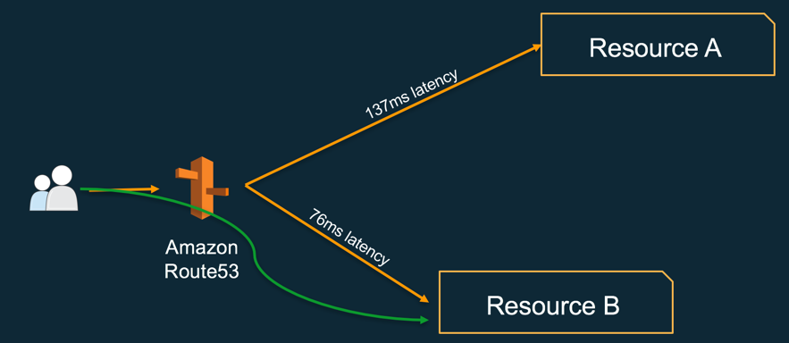
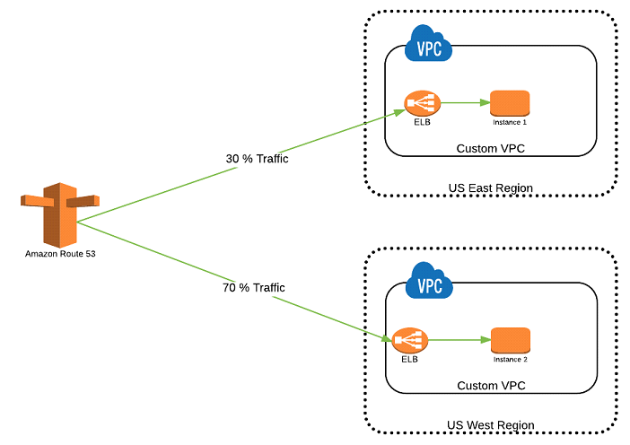
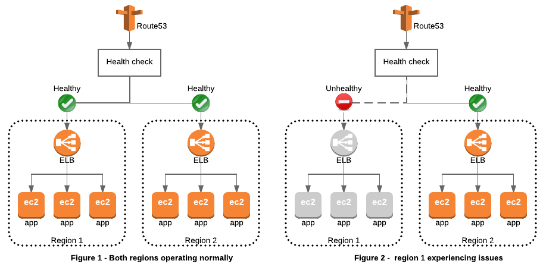
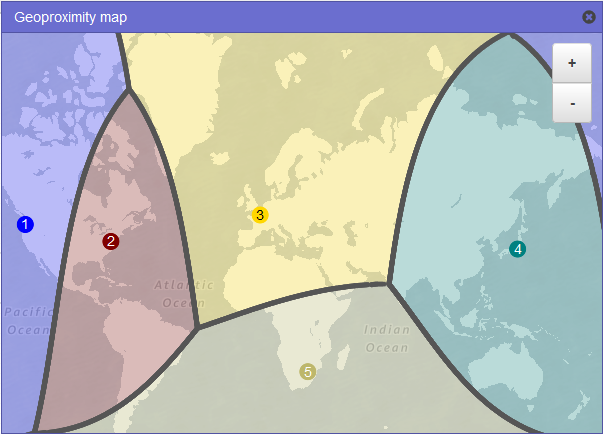

Route53
===

AWS에서 제공하며 AWS 리소스들과 연동이 가능한 DNS 서비스  

DNS 서비스는 도메인에 연결된 IP 주소를 알려준다.  
보통 일반적으로 사용하는 DNS 서비스 혹은 직접 구축한 DNS 서버는 도메인당 IP 주소 한 개만 설정 가능. 그렇기 때문에 DNS 서버에 쿼리를 하면 항상 같은 IP 주소만 알려주는 것.  

## Features
Route53는 일반적인 DNS 서버들과 달리 아래와 같은 기능들도 제공.
* __Latency Based Routing__  

    * 현재 위치에서 지연 시간(Latency)이 가장 낮은 리전의 IP 주소를 알려줌
    * Latency가 낮다는 것은 현재 위치에서 가장 가깝고 속도가 빠르다는 것
    * LBR을 실제 구축하기 위해서는 DNS 서버 뿐만 아니라 전 세계 곳곳에 실제 서비스 서버를 배치해야 하기 때문에 커다란 비용이 들지만, AWS의 글로벌 인프라가 있기에 Route53만으로 가능하게 되는 것.
* __Weighted Round Robin__  

    * 서버마다 가중치(Weight)를 부여하여 traffic을 조절하는 기능
    * 가중치에 따라 클라이언트에 IP를 알려주는 비율이 달라지게 되는 것
* __DNS Failover__  

    * 장애가 발생한 서버의 IP 주소 또는 도메인(ELB)을 알려주지 않는 기능
    * 따라서 장애가 발생하여 동작하지 않는 서버에는 traffic이 전송되지 않음
* __Geo Routing__  

    * 지역별로 다른 IP 주소를 알려주는 기능
    * 같은 example.com 도메인이라도 영국에서는 79.125.8.27, 브라질에서는 177.71.128.60, 한국에서는 54.92.43.31을 알려줌
    * 특히, 미국에서는 state별로 다른 IP를 알려주도록 설정도 가능
    * Route53는 CloudFront 또는 S3와 연동할 때 Zone Apex(ex. www.example.com 대신 example.com)를 지원. 일반적인 DNS에서는 CNAME(별칭 레코드)으로 연결할 때 Root Domain(ex. example.com)은 사용 불가

## How to connect Route53 to ELB
https://docs.aws.amazon.com/Route53/latest/DeveloperGuide/routing-to-elb-load-balancer.html  

## Terms
* __Zone Apex__  
    Root Domain, Naked Domain이라고도 함  
    서브 도메인이 붙지 않은 상태를 의미  
    DNS RFC(RFC 1033)에 루트 도메인은 A 레코드만 지정할 수 있음  
* __A Record__  
    DNS 서버에서 IP 주소를 알려주도록 설정하는 기능
* __CNAME__
    Canonical name. IP 주소 대신 도메인을 연결하는 기능

## Fields when creating a record set
* Name: 생성할 서브 도메인 이름. ex. ec2를 입력하면 ec2.example.com에 대해 A 레코드를 생성(서브 도메인). 아무것도 입력하지 않으면 example.com에 대해 A 레코드를 생성.
* Type: 레코드 종류. A - IPv4 Address, CNAME, MX, SDF 등등이 있음
* Alias: A 레코드만 사용할 수 있는 기능. IP 주소 대신 AWS 리소스인 S3, CloudFront, ELB를 설정 가능. A 레코드의 Alias는 IP 주소 대신 도메인에 연결하는 기능. ELB 접속 주소는 IP 주소가 아닌 도메인으로 제공되기 때문에, ELB를 지정하고 싶을 때는 A 레코드의 Alias를 사용.
    * Alias Target: AWS 리소스의 주소를 설정. Alias Target 입력란을 클릭하면 사용 가능한 AWS Resource 목록이 표시됨. 
    * Alias Hosted Zone ID: Alias Target을 선택하면 자동 설정
* TTL: Time To Live의 약자. A 레코드가 갱신되는 주기. 초 단위. 이후 레코드의 IP 주소를 바꾸면 TTL에 설정한 시간이 지나야 적용됨.
* Value: 도메인 네임을 쿼리했을 때 알려줄 IP 주소.
    * ex. CNAME으로 S3 버킷 Static Website Hosting와 연결하는 경우: http://를 제외한 www로부터 시작하는 endpoint를 입력.
    * Alias를 ELB로 지정한 경우는 value를 생략
* Routing Policy: 라우팅 정책
    * Simple
    * Weighted: Weighted Round Robin
        * CNAME은 사용 불가. A레코드 사용
        * Weight: 가중치를 설정. 0 ~ 255까지 설정. 각 레코드별 가중치 계산은 [ 설정한 가중치 / 전체 가중치의 합계 ]
        * Set ID: 같은 도메인의 WRR A 레코드끼리 구분할 수 있도록 ID를 설정. ex. Tokyo Data Center, Seoul Data Center
    * Latency: Latency Based Routing
        * Region: Value에 입력된 IP 주소, Alias Target에서 선택한 ELB가 속한 리전이 자동으로 선택됨
        * Set ID: 같은 도메인의 LBR A 레코드끼리 구분할 수 있도록 ID를 설정. ex. Tokyo Data Center, Seoul Data Center
    * Failover: DNS Failover
        * Failover Record Type: 현재 레코드가 Primary인지 Secondary인지 설정.
        * Set ID: Failover 레코드끼리 서로 구분하는 ID
        * Associate with Health Check: Health Check 설정과 연동할지 설정
        * Health Check to Associate: 현재 생성되어 있는 모든 Health Check 목록이 표시됨.
    * Geolocation: Geo Routing
        * 지역은 달라도 같은 IP 주소를 설정할 수 있음
        * Location: 지역 설정이며 국가별로 선택 가능
        * Sublocation: 미국은 state를 선택 가능
        * Set ID: 같은 도메인의 Geolocation A 레코드끼리 구분할 수 있도록 ID를 설정. ex. Tokyo Data Center, Seoul Data Center
    * Multivalue Anser
* Evaluate Target Health: 서버 동작 상태 체크(Health Check)를 사용할지 설정

※ Zone Apex 지원: 루트 도메인을 IP 주소가 아닌 S3 Endpoint와 같은 URL로 연결하는 것이 Zone Apex(최상위 도메인, TLD)지원 기능임.

## Fields when creating dns health check
* Name: 서버 동작 상태 체크의 이름. Optional
* Protocol: 서버 동작 상태 체크시 사용할 프로토콜. HTTP, HTTPS, TCP가 있음
* Specify Endpoint By: 서버 동작 상태를 체크할 때 IP 주소로 할지, 도메인으로 할지 설정.
* IP Address: 서버 동작 상태를 체크할 때 접근할 IP 주소 설정. EC2 인스턴스의 공인 IP 주소 사용
* Host Name: 동작 상태를 체크하는 서버 이름. Optional
* Port: 서버 동작 상태 체크 시 접근할 포트 번호
* Path: 서버 동작 상태 체크 시 접근할 파일의 URL.
    * ex. /index.html, /sample/healthcheck.html과 같이 입력
    * 비워두면 기본값이 사용됨
* Request Interval: 서버 동작 체크 주기
* Failure Threshold: 서버 접근에 실패 했을 시, 재시도 횟수
* Enable String Matching: 서버에서 출력하는 파일의 내용(body)에서 특정 문자열로 상태를 판단할지 설정
* Search String: 파일 내용에서 검색할 문자열 설정
* URL: 서버 동작 상태 체크 시 접근할 URL. 위에서 설정한 내용대로 자동 생성
* Health Check Type: 서버 동작 상태 체크 종류. 위의 입력 내용으로 자동 생성

## etc
* Route53를 통해 도메인 구매가 가능하며, delegation set의 name server는 자동으로 등록됨.
* 또는 외부에서 산 도메인의 등록도 가능

