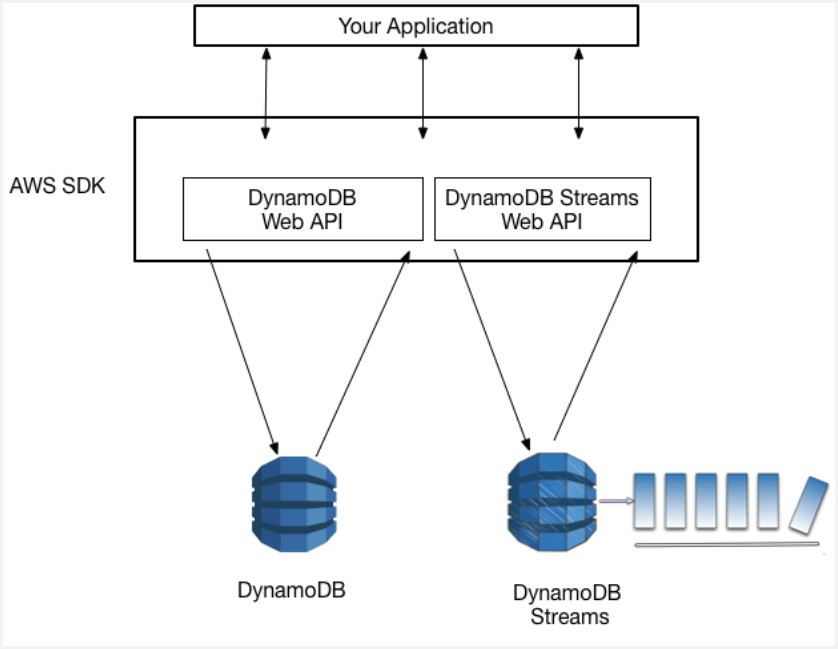

## S3 is not part of your VPC

- Unlike your EC2 instances, EBS volumes, ELBs, and other services which typically reside within your private network, __S3 is not part of your VPC__.
- An EC2 instance needs to have access to the Internet, via the Internet Gateway or a NAT Instance/Gateway in order to access S3.
- Alternatively, you can also create a VPC endpoint so your private subnet would be able to connect to S3.

## DynamoDB Streams

- captures a time-ordered sequence of item-level modifications in any DynamoDB table, and stores this information in a log for up to 24 hours.
- Applications can access this log and view the data items as they appeared before and after they were modified, in near real time.
- A _DynamoDB stream_ is an ordered flow of information about changes to items in an Amazon DynamoDB table. When you enable a stream on a table, DynamoDB captures information about every modification to data items in the table.
- Whenever an application creates, updates, or deletes items in the table, DynamoDB Streams writes a stream record with the primary key attribute(s) of the items that were modifed. 
- A _stream record_ contains information about a data modification to a single item in a DynamoDB table. You can configure the stream so that the stream records capture additional information, such as the "before" and "after" images of modified items.

## DynamoDB does not have a Cross-Region Replication feature but...
- All of your data is stored in partitions, backed by solid state disks(SSDs) and automatically replicated across multiple AZs in an AWS region, providing built-in high availability and data durability.
- DynamoDB does not have a Cross-Region Replication feature similar to S3.
- But you can use __DynamoDB Global Tables__ to automatically replicate tables across two or more AWS Regions, with full support for multi-master writes.