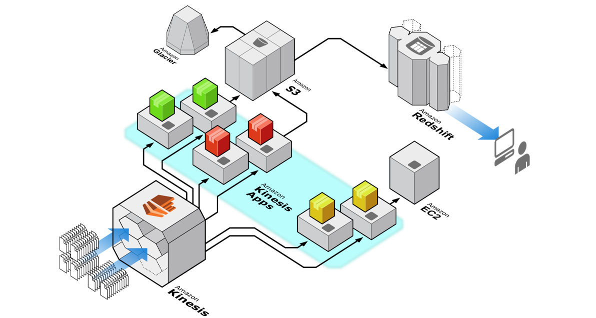

Kinesis
===

## AWS Says, "Fully managed streaming data service".  
Easily collect, process, and analyze video and data streams in real time, so you can get timely insights and react quickly to new information.  

위의 그림은, 다양한 소스에서 데이터가 Kinesis 스트림에 추가되고, 스트림 데이터가 다양한 Kinesis 애플리케이션에서 사용된다. 한 애플리케이션(노랑)이 스트리밍 데이터에 대해 실시간 대시보드를 실행하고 있음. 다른 애플리케이션(빨강)에서는 간단한 집계를 수행하고 처리한 데이터를 S3로 내보내고 있음. S3데이터는 추가적인 처리 과정을 거친 후 복잡한 분석을 위해 Redshift에 저장됨. 세번째 애플리케이션(초록)은 S3로 원시 데이터를 내보내는데, 이 데이터는 좀 더 저럼한 장기 저장을 위해 Glacier에 보관. 이러한 세가지 유형의 데이터 처리 파이프 라인은 모두 동시에 병렬로 발생.  

여러 배치의 경우 실시간 보다는 30분, 1시간, 1일 등의 정해진 간격으로만 배치 작업을 하기 때문에 데이터 속도보다 빠르지 못하거나 데이터 분석을 할 수 없는 경우가 많아 만약 분석을 했다하더라도 이미 과거의 정보일 뿐. 그렇기 때문에 Kinesis는 스트리밍이고 그 스트리밍을 완전관리형으로 만든 것.  

즉, __Kinesis를 사용하면 모든 데이터가 수집된 후에야 처리를 시작할 수 있는 것(Batch와 같은)이 아니라 데이터가 수신되는 대로 처리 및 분석하여 즉시 대응이 가능__  

## What can you build with Amazon Kinesis?  

- Evolve from batch to real-time analytics  
    -> Perform real-time data analytics on data that has been traditionally analyzed using batch processing in data warehouse or using Hadoop frameworks.  

  
- Build real-time application  
    -> Create visibility into what your customers, applications, and products are doing right now by building real-time applications for application monitoring, fraud detection, and live leader-boards.  

  
- Analyze IoT device data  
    -> Processing streaming data from consumer applications, embedded sensors, TV set-top boxes, and other IoT devices. Send real-time alerts or perform other actions programmatically based on data.  

## Benefits & Features
- Real-time  
    -> Ingest, buffer and process data instantly, so you derive insights in seconds or minutes instead of hours or days.  
- Fully managed  
    -> Run all your streaming applications without having to deploy and maintain costly infrastructure  
- Scalable  
    -> Handle any amount of streaming data, and process it from hundreds of thousands of sources with low latency  

## Kinesis Services  
- Kinesis Data Firehose  
    -> fully managed service for delivering real-time streaming data to destinations such as S3, Redshift, ES, and Splunk  
    -> You don't need to write applications or manage resources.  
    -> You configure your data producers to send data to Kinesis Data Firehose, and it automatically delivers the data to the destination taht you specified.  
    -> __You can also configure Kinesis Data Firehose to transform your data before delivering it.__  
- Kinesis Data Streams  
- Kinesis Video Streams  
- Kinesis data Analytics  
    -> Enables you to quickly author SQL code that continuously reads, processes, and stores data in near real time.  
    -> Using standard SQL queries on the streaming data, you can construct applications that transform and provide insights into your data.  
    -> Followings are some of example scenarios for using Kinesis Data Analytics:  
        -> __Generate time-series analytics__: You can calculate metrics over time windows, and then stream values to S3 or Redshift through a Kinesis data delivery stream.  
        -> __Feed real-time dashboards__: You can send aggregated and processed streaming data results downstream to feed real-time dashboards.  
        -> __Create real-time metrics__: You can create custom metrics and triggers for use in real-time mornitoring, notifications, and alarms.  

