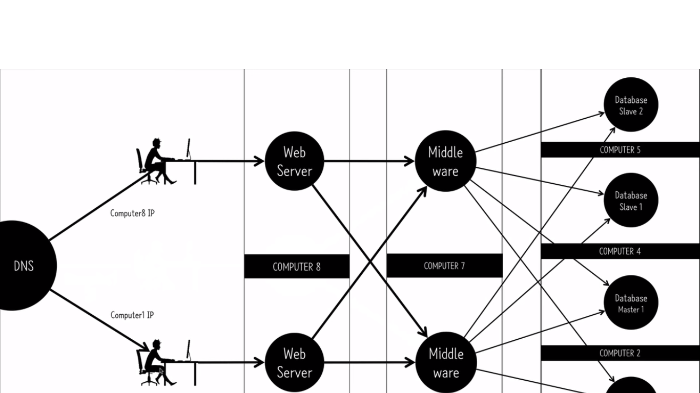
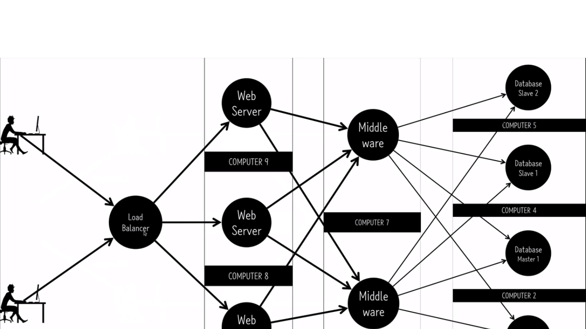

Scalability
===

 ## Scalability
  * 확장성이라는 의미로서 사용자 수의 증대에 유연하게 대응할 수 있는 정도를 의미
  

 ## Scale Up
  * AWS의 EC2에서는 서버 사용량 증대에 따른 instance type의 변경 또는 서버 수의 증감 등을 통해 유연하게 그때그때 상황에 따른 대처가 가능하다.
  * 서버의 부하가 발생한다면 Scale Out보다는 먼저 Scale Up으로 대처가 가능하다면 Scale Up을 먼저 시도하는 편이 좋다.
  * 왜냐하면, Scale Out은 각 서비스 시스템의 의존관계가 높아져 관리가 복잡해지기 떄문

 ## Scale Out
  * 예를 들어, 하나의 instance에 web server, middle ware, database를 모두 deploy하여 운영 중인 경우, 점점 해당 서비스에 대한 수요가 늘어 부하가 늘어난다면, 속도가 저하가 되고 여러 가지 문제에 직면하게 되어 user experience가 낮아지게 된다.
  * Scale Up을 통하여 커버가 불가하다면 Scale out를 생각하게 된다.
  * Scale Out은 해당 서비스에 대한 여러가지 역할 시스템들을 별도의 instance로 뗴어 내어 시스템 부하를 분산시키는 것.
  * 예를 들어, database에서 부하가 커지고 있다는 것을 알게 된다면, database를 서로 다른 서버의 slave와 master로 분리 시키거나, sharding을 늘리거나 하는 식으로 계속 나누어 가게 되는 것
  * 서버의 의존관계는 늘어나게 되지만, 이전 보다 훨씬 안정적으로 서버 부하에 대응하여 서비스를 제공할 수 있게 된다.
  * AWS에서는 이를 auto scaling을 통하여 사람이 그때그떄 manual로 대응하는 것이 아닌 자동화 서비스를 제공하고 있다.
 
  * 하나의 서버(컴퓨터)에 있던 web server, middle ware, database를 모두 분산 시키고, DNS 서버에 서로 다른 IP 주소를 하나의 같은 도메인에 등록하여 움직이도록 하였다.

  * 위와 같은 방법이며 하나의 도메인에 복수의 IP 등록 대신, AWS의 load balancer를 이용하여 사용량 부하를 분산시키도로 하였다. 
