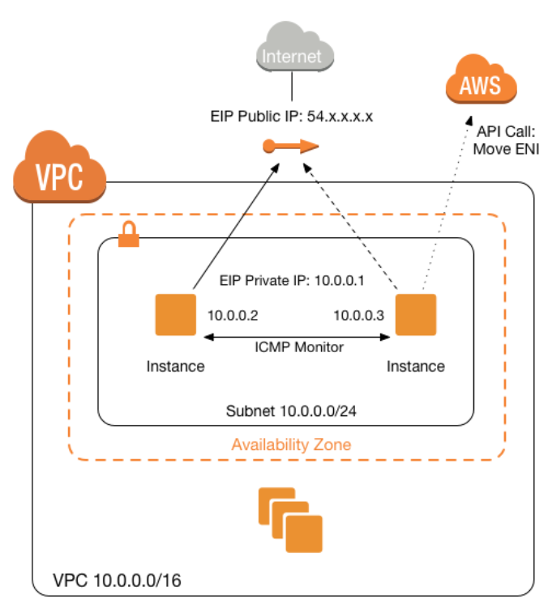

OpsWorks
===
- configuration management service that provides managed instnaces of Chef and Puppet.
- Chef and Puppet are automation platforms taht allow you to use code to automate the configurations of your servers.
- OpsWorks lets you use Chef and Puppet to automate how servers are configured, deployed and managed across your Amazon EC2 instances or on-premises compute environments.
- OpsWorks has 3 offerings
    - AWS OpsWorks for Chef Automate
    - AWS OpsWorks for Puppet Enterprise
    - AWS OpsWorks Stacks

ASG
===

Scaling based on a schedule allows you to scale your application in response to predictable load changes.  
ex) Every week the traffic to your web application starts to increase on Wednesday, remains high on Thursday, and starts to decrease on Friday. 
You can plan your scaling activities based on the predictable traffic patterns of your web application.

To configure your ASG to scale based on a schedule, you create a scheduled action. The scheduled action tells Amazon EC2 Auto Scaling to perform a scaling action at specified times.

You can create scheduled actions for scaling one time only or for scaling on a recurring schedule.

IAM
===
You can authenticate to your DB instance using AWS Identity and Access Management(IAM) database authentication. IAM database authentication works with MySQL and PostgreSQL. With this authentication method, you don't need to use a password when you connect to a DB instance. Instead, you use an authentication token.  

An authentication token is a unique string of characters that Amazon RDS generates on request. Authentication tokens are generated using AWS Signature Version 4. Each token has a lifetime of 15 minutes. You don't need to store user credentials in the database, because authentication is managed externally using IAM. You can also still use standard database authenticaiton.

IAM database authentication provides the following benefits:
    1. Network traffic to and from database is encrypted using Secure Sockets Layer(SSL).
    2. You can use IAM to centrally manage access to your database resources, instead of managing access individually on each DB instance.
    3. For applications running on Amazon EC2, you can use profile credentials specific to your EC2 instance to access your database instead of a password, for greater security.

Security Group
===
A _security group_ acts as a virtual firewall for your instance to control inbound and outbound traffic. When you launch an instance in a VPC, you can assign up to five security groups to the instance. Security groups act at the instance level, not the subnet level. Therefore, each instance in a subnet in your VPC could be assigned to a different set of security groups. If you don't specify a particular group at launch time, the instance is automatically assigned to the default security group for the VPC.
When you add or remove rules, those changes are automatically applied to all instances to which you've assigned the security group. 

Best way to  encrypt sensitive environment variables like API credentials or storing sensitive database that Lambda function has
===
- Create a new KMS key and use it to enable encryption helpers that leverage on AWS Key Management Service to store and encrypt the sensitive information.
- When you create or update Lambda functions that use environment variables, AWS Lambda encrypts them using the AWS Key Management Service. When your Lambda function is invoked, environment variables of Lambda are decrypted and made available to the Lambda code.
- The first time you create or update Lambda functions that use environment variables in a region, a default service key is created for you automatically within AWS KMS. This key is used to encrypt environment variables after your Lambda function is created, you must create your own AWS KMS key and choose it instead of the default key. The default key will give errors when chosen. Creating your own key gives you more flexibility, including the ability to create, rotate, disable, and define access controls, and to audit the encryption keys used to protect your data.
- Lambda does not encrypt environment variables by default during the deployment process. When you deploy your Lambda function, all the environment variables you've specified are encrypted by default after, but not during, the development process.

Lambda@Edge
===
- Lets you run Lambda functions to customize content that CloudFront delivers, executing the functions in AWS locations closer to the viewer. The functions run in response to CloudFront events, without provisioning or managing servers.  
- You can use Lambda functions to change CloudFront requests and responses at the following points:

    - After CloudFront receives a request from a viewer (viewer request)
    - Before CloudFront forwards the request to the origin (origin request)
    - After CloudFront receives the response from the origin (origin response)
    - Before CloudFront forwards the response to the viewer (viwer response)
- You can automate your serverless application's release process using AWS CodePipeline and AWS CodeDeploy.
- Lambda will automatically track the behavior of your Lambda function invocations and provide feedback that you can monitor. In addition, it provides metrics that allows you to analyze the full function invocation spectrum, including event source integration and whether downstream resources perform as expected.

Lambda deployment configuration types to specify how traffic is shifted from the original AWS Lambda function version to the new AWS Lambda function version
===
- **Canary**:
    - Traffic is shifted in two increments. You can choose from predefined canary options that specify the percentage of traffic shifted to your updated Lambda function version in the first increment and the interval, in minutes, before the remaining traffic is shifted in the second increment.
- **Linear**:
    - Traffic is shifted in equal increments with an equal number of minutes between each increment. You can choose from predefined linear options that specify the percentage of traffic shifted in each increment and the number of minutes between each increment.
- **All-at-once**:
    - All traffic is shifted from the original Lambda function to the updated Lambda function version at once.

## Bring on-premises network to AWS
- You can bring part or all of your public IPv4 address range from your on-premises network to your AWS account. You continue to own the address range, but AWS advertises it on the internet. After you bring the address range to AWS, it appears in your account as an address pool. You can create an Elastic IP address from your address pool and use it with your AWS resources, such as EC2 instances, NAT gateways, and Network Load Balancers. This is also called "`Bring Your Own IP Addresses (BYOIP)`".
- To ensure that only you can bring your address range to your AWS account, you must authorize Amazon to advertise the address range and provide proof that you own the address range.
- A __Route Origin Authorization (ROA)__ is a document that you can create through your Regional Internet Registry (RIR), such as the American Registry for Internet Numbers (ARIN) or Réseaux IP Européens Network Coordination Centre (RIPE). It contains the address range, the ASNs that are allowed to advertise the address range, any an expiration date
- The ROA authorizes Amazon to advertise an address range under a specific AS number. However, it does not authorize your AWS account to bring the address range to AWS. To authorize your AWS account to bring an address range to AWS, you must publish a self-signed X509 certificate in the RDAP remarks for the address range. The certificate contains a public key, which AWS uses to verify the authorization-context signature that you provide. You should keep your private key secure and use it to sign the authorization-context message.

S3 Storage Classes
===
- S3 Standard: General purpose
- S3 Intelligent-Tiering: Unknown or chaning access
- S3 Standard-Infrequent Access (S3 Standard-IA): Infrequent access
- S3 Zone-Infrequent Access (S3 One Zone-IA): Infrequent access, non-critical data
- S3 Glacier: Archive
- S3 Glacier Deep Archive: Archive, lowest-cost 

S3 Intelligent-Tiering
===

- a New Amazon S3 Storage Class designed for customers who want to optimize storage costs automatically when data access patterns change, without performance impact or operational overhead. S3 Intelligent-Tiering is the first cloud object storage class that delivers automatic cost savings by moving data between two access tiers --frequent access and infrequent access-- when access pattern change, and is ideal for data with unknown or changing access patterns.
- S3 Intelligent-Tiering stores objects in two access tiers:
    -  one tier that is optimized for frequent access and another lower-cost tier that is optimized for infrequent access.
    - For a small monthly monitoring and automation fee per object, S3 Intelligent-Tiering monitors access patterns and moves objects that have not been accessed for 30 consecutive days to the infrequent access tier. There are no retrieval fees in S3 Intelligent-Tiering.
    - If an object inthe infrequent access tier is accessed later, it is automatically moved back to the frequent access tier. No additional tiering fees apply when objects are moved between access tiers within the S3 Intelligent-Tiering storage class. S3 Intelligent-Tiering is designed for 99.9% availability and 99.999999999% durability, and offers the same low latency and high throughput performance of S3 Standard.
- Amazon S3 features including S3 Object Tagging, S3 Cross-Region Replication, and S3 Select all work with S3 Intelligent-Tiering. Customers can start using S3 Intelligent-Tiering through the S3 API, CLI, and management console by putting objects directly into S3 Intelligent-Tiering or by using a S3 Lifecycle policy to move objects from S3 Standard or S3 Standard-IA to S3 Intelligent-Tiering. Customers can also archive obejcts with a S3 Lifecycle policy from S3 Intelligent-Tiering into Amazon S3 Glacier.
- S3 Intelligent-Tiering charges a small tiering fee and has a minimum eligible object size of 128KB for auto-tiering. Smaller objests may be stored but will always be charged at the Frequent Access tier rates.

## S3 Pre-Signed URLs

- In Amazon S3, all objects are private by default. Only the object owner has permission to access these objects. 
- However, the object owner can optionally share objects with others **by creating a pre-signed URL**, using their own security credentials, **to grant time-limited permission to download the objects**.
- When you create a pre-signed URL for your object, you must provide your security credentials, specify a bucket name, an object key, specify the HTTP method (GET to download the object) and expiration date and time. The pre-signed URLs are valid only for the specified duration.
- Anyone who receives the pre-signed URL can then access the object. For example, if you have a video in your bucket and both the bucket and the object are private, you can share the video with others by generating a pre-signed URL.

## Avoiding accidental deletion in Amazon S3 bucket
- Enable **Versioning**
    - Versioning is a means of keeping multiple variants of an object in the same bucket.
    - You can use versioning to preserve, retrieve, and restore every version of every object stored in Amazon S3 bucket.
    - With versioning, you can easily recover from both unintended user actions and application failures.
- Enable **MFA(Multi-Factor Authentication)** Delete
    - If the MFA Delete is enabled, it requires additional authentication for either of the following operations:
        - Change the versioning state of your bucket
        - Permanently delete an object version

## Prerequisites for routing traffic to a website that is hosted in an Amazon S3

- An S3 bucket that is configured to host a static website. **The bucket must have the same name as your domain or subdomain**. For example, if you want to use the subdomain portal.dev.com, the name of the bucket must be portal.dev.com.
- A registered domain name. You can use Route53 as your domain register, or you can use a different register.
- Route53 as the DNS service for the domain. If you register your domain name by using Route 53, we automatically configure Route 53 as the DNS service for the domain.
※ Route 53 MX record specifies the mail server responsible for accepting email messages on behalf of a domain name.  
※ You only need to enable Cross-Origin Resource Sharing (CORS) when your client web application on one domain interacts with the resources in a different domain.  

## S3 Pre-Signed URLs vs CloudFront Singed URLs vs Origin Access Identity(OAI)

## how to ensure data security
- You can secure the privacy of your data in AWS, both at rest and in-transit, through encryption.
- If your data is stored in EBS volume, you can enable EBS Encryption.
- If it is stored on Amazon S3, you can enable client-side and server-side encryption.
※ There is no such thing as On-Premises Data Encryption for S3 and EBS as these services are in the AWS cloud and not on your on-premises network.

## HVM AMI
- is required to take advantage of enhanced networking and GPU processing. 
- In order to pass through instructions to specialized network and GPU devices, the OS needs to be able to have access to the native hardware platform which the HVM virtualization provides.
- Although the enhanced networking feature can provide higher I/O performance and lower CPU utilization to your EC2 instance, you have to use an HVM AMI instead of PV AMI.

## How to increase the write performance of the database hosted in an EC2 instance.
- You can achieve this by either setting up a standard RAID 0 configuration or simply by increasing the size of the EC2 instance.
- Some EC2 instance types can drive more I/O throughput than what you can provision for a single EBS volume. You can join multiple gp2, io1, st1, or sc1 volumes together in a RAID 0 configuration to use the available bandwidth for these instances.

## Redundant Array of Inexpensive Disks (RAID)
- 여러 개의 디스크를 배열하여 속도의 증대, 안정성의 증대, 효율성, 가용성의 증대를 하는데 쓰이는 기술
- 종류와 구성방식
    - RAID 0
        - Concatenate 방식: 두개 이상의 디스크에 데이터를 순차적으로 쓰는 방법
        - Stripe 방식: 두개 이상의 디스크에 데이터를 랜덤하게 쓰는 방법
        - more suitable option for providing faster read and write operations, compared with RAID 1
    - RAID 1 (Mirror)
        - 볼륨 내의 패리티를 사용하지 않고 디스크에 같은 데이터를 중복 기록하여 데이터를 보존하게 되며, 적어도 동일한 용량의 디스크가 두 개가 필요.
        - provide mirroring redundancy, and fault-tolerance
    - RAID 2
        - RAID 0처럼 striping 방식이지만 에러 체크와 수정을 할 수 있도록 Hamming code를 사용하고 있는 것이 특징
        - 하드 디스크에서 ECC(Error Correction Code)를 지원하지 않기 때문에 ECC를 별도의 드라이브에 저장하는 방식으로 처리
        - 하지만 ECC를 위한 드라이브가 손상될 경우는 문제가 발생할 수 있으며 패리티 정보를 하나의 하드 드라이브에 저장하는 RAID 4가 나오면서 거의 사용되지 않는 방식
    - RAID 3, 4
        - RAID 0, 1의 문제점을 보완하기 위한 방식으로 3, 4로 나뉘긴 하지만 구성 방식은 거의 같다. RAID 3, 4는 기본적으로 RAID 0과 같은 striping 구성을 하고 있어 성능을 보완하고 디스크 용량을 온전히 사용할 수 있게 해주는데 여기에 추가로 에러 체크 및 수정을 위해서 패리티 정보를 별도의 디스크에 따로 저장
        - RAID 3은 데이터를 바이트 단위로 나누어 디스크에 동등하게 분산 기록, RAID 4는 데이터를 블록 단위로 나눠 기록하므로 완벽하게 동일하진 않다는 차이가 있다.
        - RAID 3은 드라이브 동기화가 필수적이라 많이 사용되지 않고 RAID 4를 더 많이 쓴다
    - RAID 5
        - RAID 3, 4에서 별도의 패리티 정보 디스크를 사용함으로써 발생하는 문제점을 보완하는 방식으로 패리티 정보를 stripe로 구성된 디스크 내에서 처리하게 만듦.
        - 만약 1개의 하드가 고장나더라도 남은 하드들을 통해 데이터를 복구 할 수 있다는 장점
    - RAID 6
        - RAID 5와 같은 개념이지만 다른 드라이브들 간에 분포되어 있는 2차 패리티 정보를 넣어 2개의 하드에 문제가 생겨도 복구할 수 있게 설계되었으므로 RAID 5보다 더욱 데이터의 안전성을 고려하는 시스템에서 사용.

## Amazon HSM 
- a cloud-based hardware security module (HSM) that enables you to easily generate and use your own encryption keys on the AWS Cloud.
- With CloudHSM, you can manage your own encryption keys using FIPS 140-2 Level 3 validated HSMs.

## Amazon KMS (Key Management Service)

## OLAP (Online Analytical Processing)
- Amazon Redshift, etc
## OLTP (Online Transaction Processing)
- RDS and DynamoDB

## Amazon Redshift
- Fully managed, __petabyte-scale data warehouse__ service
- extends data warehouse queries to your data lake. You can run analytic queries against petabytes of data stored locally in Redshift, and directly against exabytes of data stored in S3.
- is an OLAP type of DB
- currently, only supports Single-AZ deployments.
- Feature
    - uses **columnar storage**, data compression, and zone maps to reduce the amount of I/O needed to perform queries.
    - uses a **massively parallel processing** data warehouse architecture to parallelize and distribute SQL operations.
    - uses machine learning to deliver high throughout based on your workloads.
    - uses **result caching** to deliver sub-second response times for repeat queries.
    - automatically and continuously backs up your data to S3. It can asynchronously replicate your snapshots to S3 in another region for disaster recovery.
- components
    - Cluster
    - Redshift Nodes
    - Parameter Groups
        - a group of parameters that apply to all of the databases that you create in the cluster. The default paramter group has preset values for each of its paramters, and it cannot be modified.
- Database Querying Options
    - Connect to your cluster and run queries on the AWS Management Console with the Query Editor
    - Connect to your cluster through a SQL client tool using standard ODBC and JDBC connections.
- **Enhanced VPC Routing**
    - By using Enhanced VPC Routing, you can use VPC features, such as VPC security groups, network access control lists (ACLs), VPC endpoints, VPC endpoint policies, internet gateway, and Domain Name System (DNS) servers, to manage the flow of data between your cluster and other resources.
    - You can also use VPC flow logs to monitor __COPY__ and __UNLOAD__ traffic.
        - When you use Amazon Redshift Enhanced VPC Routing, Amazon Redshift forces all COPY and UNLOAD traffic between your cluster and your data repositories through your Amazon VPC.
    - If Enhanced VPC Routing is not enabled, Amazon Redshift routes traffic through the Internet, including traffic to other services within the AWS network.
- **RedShift Spectrum**
    - Enables you to run queries against exabytes of data in S3 **without having to load or transform any data**.
        - enabled you to query and analyze all of your data in Amazon S3 using the open formats you already use, with no data loading or transformations needed.
    - Redshift Spectrum doesn't use Enhanced VPC Routing
    - If you store data in a columnar format, Redshift Spectrum scans only the columns needed by your query, rather than processing entire rows.
    - If you compress your data using one of Redshift Spectrum's supported compression algorithms, less data is scaned.

## EFS

- Amazon Elastic File System (EFS) provides simple, scalable, elastic file storage for use with AWS Cloud services and on-premises resources.
- When mounted on Amazon EC2 instances, an Amazon EFS file system provides a standard file system interface and file system access semantics, allowing you to seamlessly integrate Amazon EFS with your existing applications and tools.
- Multiple Amazon EC2 instances can acess an Amazon EFS at the same time, allowing Amazon EFS to provide a common data source for workloads and applications running on more than one Amazon EC2 instance.
- Example: there is a fleet of On-Demand EC2 instances that stores file doucments from the users to one of the attached EBS volumes. 
    - Problem: The system performance is quite slow because the architecture doesn't provide the EC2 instances a parellel shared access to the file documents.
    - Solution: Remember that an EBS volume can be attached to one EC2 instance at a time, hence, no ther EC2 instance can connect to that EBS Provisioned IOPS volume. Take note as well that the type of storage needed here is a "file storage" which means that S3 is not the best service to use because it is mainly used for "object storage", and S3 does not provide the notion of "folders" too.
    ※ ElastiCache is an in-memory data store that improves the performance of your applications, which is not what you need since it is not a file storage.

## CloudTrail

- service that enables governance, compliance, operational auditing, and risk auditing of your AWS account. With CloudTrail, you can log, continuously monitor, and retain account activity related to actions across your AWS infrastructures.
- provides event history of your AWS account acivitiy, including actions taken through the AWS Management Console, AWS SDKs, command line tools, API calls, and other AWS services. This event history simplifies security analysis, resource change tracking, and troubleshooting.
- although CloudWatch is also monitoring service, it cannot track the API calls to your AWS resources.

## AWS X-Ray
- helps you debug and analyze your microservices applications with request tracing so you can find the root cause of issues and performance.

## Terminology
- SIT: System Integration Testing, is part of Functional Testing
- UAT: User Acceptance Testing, is part of Functional Testing
- DEV: development
- PROD : production

## Amazon Athena
- a service that enables a data analyst to perform interactive queries in the AWS on data stored in Amazon S3.
- Athena is a serverless query service, an analyst doesn't need to manage any underlying compute infrastructure to use it.
- There is also no need to load S3 data into Amazon S3 or transform it for analysis, which makes it easier and faster for an analyst to gain insight

## ephemeral store volume
- `ephmeral` literally means "short-lived" or "temporary" in the English dictionary.Hence, when you see this word in AWS, always consider this as just a temporary memory or a short-lived storage.
- The virtual devices for instance store volumes are named as `ephemeral[0-23]`. Instance types that support one instance store volumes have `ephemeral0`. Instance types that support two instance store volumes have `ephemeral0` and `ephemeral1`, and so on until `ephemeral23`.
- The data in an instance store persists only during the lifetime of its associated instance. If an instance reboots (intentionally or unintentionally), dat in the instance store persists.
- However, data in the instance store is lost under the following circumstances:
    - The underlying disk drive fails
    - The instance stops
    - The instance terminates
- instance store volumes and EBS volumes are two different storage types. 
    - An Amazon EBS volume is a durable, block-level storage device that you can attach to a single EC2 instance. 
    - An instance store provides temporary block-level storage and is located on disks taht are physically attached to the host computer. No automatic backup will be performed

## Storages that EC2 offers
- Amazon Elastic Block Store(EBS)
- Amazon EC2 Instance Store: ephemeral
- Amazon Elastic File System(EFS)
- Amazon Simple Storage Service(S3)

## snapshot process when an instance uses a RAID configuration
- Remember that since instance is using a RAID configuration, the snapshot process is different.
- **You should stop all I/O activity of the volumes before creating a snapshot.**
    1. Stop all applications from writing to the RAID array.
    2. Flush all caches to the disk.
    3. Confirm that the associated EC2 instance is no longer writing to the RAID array by taking actions such as freezing the file system, unmounting the RAID array, over even shutting down the EC2 instance.
    4. After taking steps to halt all disk-related activity to the RAID array, take a snapshot of each EBS volume in the array.
- When you take a snapshot of an attached Amazon EBS volume that is in use, the snapshot excludes data cached by applications or the operating system. For a single EBS volume, this is often not a problem. However, when cached data is excluded from snapshots of multiple EBS volumes in a RAID array, restoring the volumes from the snapshots can degrade the integrity of the array.
- When creating snapshots of EBS volumes that are configured in a RAID array, it is critical that there is no data I/O to or from the volumes when the snapshots are created. RAID arrays introduce data interdependencies and a level of complexity not present in a single EBS volume configuration.

## RDS monitoring
- Amazon RDS provides metrics in real time for the operating system (OS) that your DB instance runs on.
- You can view the metrics for your DB instance using the console, or consume the Enhanced Monitoring JSON output from the CloudWatch Logs in a monitoring system of your choice.
- By default, Enhanced Monitoring metrics are stored in the CloudWatch Logs for 30 days. To modify the amount of time the metrics are stored in the CloudWatch Logs, change the retention for the `RDSOSMetrics` log group in the CloudWatch console.
- Certain differences between CloudWatch and Enhanced Monitoring Metrics
    - CloudWatch gathers metrics about CPU utilization from the hypervisor for a DB instance
    - Enhanced Monitoring gathers its metrics from an agent on the instance.
    - Because of difference of the measurements, the hypervisor layer performs a small amount of work.
        - Hence, when you need to closely monitor how the different processes or threads on a DB instance use the CPU, including the percentage of the CPU bandwidth and total memory consumed by each process to maintain the reliability, availability, and performance of your system, the most suitable solution to properly monitor databases is to enable Enhanced Monitoring in RDS.
            - Although you can use Amazon CloudWatch to monitor the CPU Utilization of your db instance, it does not provide the percentage of the CPU bandwidth and total memory consumed by each database process in your RDS instance.
            - CloudWatch gathers metrics about CPU utilization from the hypervisor for a DB instance while RDS Enhanced Monitoring gathers its metrics from an agent on the instance.
            - You do not have direct access to the instances/servers of your RDS database instance, unlike with your EC2 instances where you can install a CloudWatch agent or a custom script to get CPU and memory utilization of your instance.
        - The differences can be greater if your DB instances use smaller instance classes, because then there are likely more virtual machines(VMs) that are managed by the hypervisor layer on a single physical instance. Enhanced Monitoring metrics are useful when you want to see how different processes or threads on a DB instance use the CPU.

## Amazon EMR
- Amazon EMR provides you a managed Hadoop framework that makes it easy, fast, and cost-effective to process vast amounts of data across dynamically scalable Amazon EC2 instances.
- You can access the operating system of these EC2 instances that were created by Amazon EMR.

## SSH Connection and CIDR block
- SSH protocol uses TCP and port 22.
- __/32__ denotes one IP address
- __/0__ refers to the entire network

## Relation between ASG and ELB health checks
- There are two ways of checking the status of your EC2 instances:
    - via the ASG
    - via ELB health checks
- ASG
    - The default health checks for an ASG are __EC2 status checks__ only.
    - If an instance fails these status checks, the ASG considers the intance unhealthy and replaces.
    - __If you attached one or more load balancers or target groups to your ASG, the group does not, by default, consider an instance unhealthy and replace it if it fails the load balancer health checks.__
    - __However, you can optionally configure the ASG to use ELB health checks, it considers the instance unhealthy if it fails either the EC2 status checks or the load balancer health checks.__ This ensures that the group can determine an instances's health based on additional tests provided by the load balancer. The load balancer periodically sends pings, attempts connections, or sends requests to test the EC2 instances. These tests are called __health checks__.

## Temporary credentials in AWS
- Temporary credentials are useful in scenarios that involve identity federation, delegation, cross-account, and IAM roles.
- Example scenario: all 1200 employees would be granted access to use Amazon S3 for storage of their personal documents. And also it is required to incorporates single sign-on feature from your corporate AD or LDAP directory and also restrics access for each individual user to a designated user folder in an S3 bucket
    - In this example, it is called __enterprise identity federation__ considering that you also need to set up sigle sign-on (SSO) capability.
    - suitable solution:
        - to set up a Federation proxy or an Identity provider
        - to set up an AWS Security Token Service(AWS STS) to generate temporary tokens
        - to configure an IAM role

- In an enterprise identity federation, you can authenticate users in your organization's network, and then provide those users access to AWS without creating new AWS identities for them and requiring them to sign in with a seperate user name and password. This is known as the _single sign-on_ (SSO) approach to temporary access. AWS STS supports opend standards like Security Assertion Markup Language (SAML) 2.0, with which you can use Microsoft ADFS to leverage your Microsoft Active Directory. You can also use SAML 2.0 to manage your own solution for federating user identities.

## SAML

- Security Assertion Markup Language (SAML) is an open standard that allows identity providers(IdP) to pass authorization credentials to service providers (SP), which means that you can use one set of credentials to log into many different websites.
- SAML transactions use Extensible Markup Language (XML) for standardized communcations between the IdP and SP. SAML is the link between the authentication of a user's identity and the authorization to use a service.
- SAML enables Single Sign-On (SSO), a term that means users can log in once, and those same credentials can be reused to log into other service providers.
- compose
    - Identity Provider (IdP)
    - Service Provider (SP)
- SAML Assertion
    - XML document that the identity provider sends to the service provider that contians the user authorization
    - There are three different types of SAML Assertion
        - Authentication assertions: prove identification of the user and provide the time the user logged in and what method of authentication they used(i.e. Kerberos, two-factor, etc)
        - Attribution assertions: passes the SAML attributes to the service provider - SAML attributes are specific pieces of data that provide information about the user
        - Authorization assertions: says if the user is authorized to use the service or if the identify provider denied their request due to a password failure or lack of rights to the service
- SAML vs OAuth
    - OAuth is a slightly newer standard that was co-developed by Google and Twitter to enable streamlined internet logins.
    - OAuth uses a similar methodology as SAML to share login information.
    - SAML provides more control to enterprises to keep their SSo logins more secure, whereas OAuth is better on mobile and uses JSON

## Distributed Messaging System
- Three main parts
    - components of your distributed system(EC2 instances)
    - your queue (distributed on Amazon SQS servers)
    - messages in the queue
- You can set up a system which has several components that send messages to the queue and receive messages from the queue. The queue redundantly stores the messages across multiple Amazon SQS servers.

- Refer to the third step of the SQS Message Lifecycle:
    1. Components 1 sends Message A to a queue, and the message is distributed across the Amazon SQS servers redundantly.
    2. When Component 2 is ready to process a message, it consumes messages from the queue, and Message A is returned. While Message A is being processed, it remains in the queue and isn't returned to subsequent receive requests for the duration of the visibility timeout.
    3. Component 2 __deletes__ Message A from the queue to prevent the message from being received and processed again once the visibility timeout expires.
- Always remember that the messages in the SQS queue will continue to exist even after the EC2 instance has processed it, until you delete that message. You have to ensure that you delete the message after processing to prevent the message from being received and processed again once the visibility timeout expires.

## WLM
- WorkLoad Management
- When you create a paramter group, the default WLM configuration contains one queue that can run up to five queries concurrently. You can add additional queues and configure WLM properties in each of them if you want more control over query processing. Each queue that you add has the same default WLM configuration until you configure its properties. When you add additional queues, the last queue in the configuration is the _default queue_. Unless a query is routed to another queue based on criteria in the WLM configuration, it is processed by the default queue. You cannot specify user groups or query groups for the default queue.

## Amazon EBS Encryption
- Amazon EBS encryption offers a simple encryption solution for your EBS volumes without the need to build, maintain, and secure your own key management infrastructure.
- When ou create an encrypted EBS volume and attach it to a supported instance type, the following types of data are encrypted:
    - Data at rest inside the volume
    - All data moving between the volume and the instance
    - All snapshots created from the volume
    - All volumes created from those snapshots
- If a EBS volume attached to the instance is already unencrypted, the best way to encrypt the data is to create and mount a new, encrypted Amazon EBS volume. Then, move the data to the new volume and finally delte the old, unencrypted Amazon EBS volume.
    - You cannot encrypt the volume even if you unmount the volume. Remember taht encryption has to be done during volume creation.
    - You cannot create an encrypted snapshots of an unencrypted volume or change existing volume from unencrypted to encrypted. You have to create new encrypted volume and transfer data to the new volume.

## Amazon EBS Snapshot
- scenario: You have triggered the creation of a snapshot of your EBS volume and is currently on-going. At this point, what are the things that the EBS volume can or cannot do?

- EBS snapshots occur asynchronously which makes the volume able to be used as normal while the snapshots is in progress.
    - This means that point-in-time snapshot is created immediately, but the status of the snapshot is `pending` until the snapshot is complete (when all of the modified blocks have been transferred to Amazon S3), which can take several hours for large initial snapshots or subsequent snapshots where many blocks have changed. While it is completing, an in-progress snapshot is not affected by ongoing reads and writes to the volume hence, you can still use the volume.
    - Although you can take a snapshot of a volume while a previous snapshot of that volume is in the pending status, having multiple pending snapshots of a volume may resutl in reduced volume performance until the snapshots complete.

## DynamoDB
- NoSQL database service that provides fast and predictable performance with seamless scalability.
- offers encryption at rest.
- You can create database tables that can store and retrieve any amount of data, and serve any level of request traffic.
- You can scale up or scale down your tables' throughput capacity without downtime or performance degradation, and use the AWS Management Console to monitor resource utilization and performance metrics.
- Provides on-demand backup capability as well as enable point-in-time recovery for your DynamoDB tables. With point-in-time recovery, you can restore that table to any point in time during the **last 35 days**.
- All of your data is stored in partitions, backed by solid state disks (SSDs) and automatically replicated across multiple AZs in an AWS region, providing built-in high availability and data durability.
- You can create tables that are automcatically replicated across two or more AWS Regions, with full support for multi-master writes.
- Core Components
    - Tables
    - Items
    - Attributes
    - Primary Key
    - Secondary Indexes
    - **DynamoDB Streams**: 
        
        - optional feature not default. You need to manually enable DynamoDB Streams.
        - an ordered flow of information about changes to items in an Amazon DynamoDB table. When you enable a stream on a table, DynamoDB captures information about every modification to data items in the tables.
        - The naming convention for DynamoDB Streams endpoints is __streams.dynamodb..amazonaws.com__
        - Whenever an application creates, updates, or deletes items in the table, DynamoDB Streams writes a __stream record__ with the primary key attributes of the items that were modified. A *stream record* contains information about a data modification to a single item in a DynamoDB table. You can configure the stream so that the stream records capture additional information, such as the "before" and "after" images of modified items.
            - A new item is added to the table: captures an image of the entire item, including all of its attributes
            - An item is updated: captures the "before" and "after" image of any attributes that were modified in the item.
            - An item is deleted from the table: captues an image of the entire item before it was deleted.
        - Each stream record also contains the name of the table, the event timestamp, and other metadata.
        - Stream records are organized into groups, or **shards**. Each shard acts as a container for muliple stream records, and contains information required for accessing and iterating through these records.
        - Stream records have a lifetime of 24 hours; after that, they are automatically removed from the stream.
        - You can use DynamoDB Streams together with AWS Lambda to create a _trigger_, which is a code that executes automatically whenever an event of interest appears in a stream. With triggers, you can build applications that react to data modification in DynamoDB tables.
            
            - If you enable DynamoDb Streams on a table, you can associate the stream ARN with a Lambda function that you write. Immediately after an item in the table is modified, a new record appears in the table's stream. AWS Lambda polls the stream and invokes your Lambda function synchronously when it detects new stream rocords. The Lambda function can perform any actions you specify, such as sending a notification or initiating a workflow.
        - DynamoDB Streams enables powerful solutions such as data replication within and across Regions, materialized views of data in DynamoDB tables, data analysis using Kinesis materialized view, and much more.

## Amazon DynamoDB Accelerator (DAX)

- a fully managed, highly available, in-memory cache that can reduce Amazon DynamoDB response times from milliseconds to microseconds, even at millions of requests per second.
- Although you may use ElasticCache as your database cache, it will not reduve the DynamoDB response time from milliseconds to microseconds as compared with DynamoDB DAX.
- With Amazon EBS, you can use any of the standard RAID configurations that you can use with a traditional bare metal server, as long as that particular RAID configuration is supported by the operating system for your instance. This is because all RAID is accomplished at the software level. For greater I/O performance than you can achieve with a single volume, RAID 0 can stripe multiple volumes together; for on-instance redundancy, RAID 1 can mirror two volumes together.

## Amazon ECS to ensure that database credentials are secure and that they cannot be viewed in plaintext on the cluster itself
- enables you to inject sensitive data into your containers by storing your sensitive data in either **AWS Secrets Manager sercrets** or **AWS System Manager Parameter Store paramters** and then referencing them in your container definition.
- For tasks that use **Fargate launch type**,
    -  the only supported method is referencing a `Systems Manager Parameter Store parameter`. This feature also requires that your task use platform version 1.3.0 or later.
- For tasks that use the **EC2 launch type**,
    - both the `Secrets Manager secret` and `Systems Manager Parameter Store Parameter` methods described are supported. This featurer requires that your container instance have version 1.22.0 or later of the container agent. However, it is recommended to use the lastest container agent version.

- Within your container definition, specify `secrets` with the name of the environment variable to set in the container and the full ARN of either the Secrets Manager secret or Systems Manager Parameter Store parameter containing the sensitive data to present to the container. The parameter that you reference can be from a different Region than the container using it, _but must be from within the same account._
- Although you can use **Docker Secrets** to secure the sensitive database credentials, this feature is only applicable in **Docker Swarm**.
- **In AWS, the recommended way to secure sensitive data is either through the use of Sercrets Manager or System Manager Parameter Store.**

## Throttling limits and Caching of Amazon API Gateway
- Amazon API Gateway provides throttling at multiple levels including global and by service call.
- Throttling limits can be set for standard rates and bursts.
    - i.e) API owners can set a rate limit of 1,000 requests per second for a specific method in their REST APIs, and also configure Amazon API Gateway to heandle a burst of 2,000 requests per second for a few seconds.
    - Amazon API Gateway tracks the number of requests per second. Any request over the limit will receive a 429 HTTP response. The client SDKs generated by Amazon API Gateway retry calls automatically when met with this response.
- You can add **caching** to API calls by provisioning an Amazon API Gateway cache and satisfying its size in gigabytes. The cache is provisioned for a specific stage of your APIs. This improves performance and reduces the traffic sent to your back end.

- Cache settings allow you to control the way the cache key is built and the time-to-live (TTL) of the data stored for each method. Amazon API Gateway also exposes management APIs that help you invalidate the cache for each stage.
※CloudFront only speeds up content delivery which provides a better latency experience for your users. It doesn't help much for the backend.

## Understanding of API Gateway
- API Gateway는 API 서버 앞단에서 모든 API 서버들의 엔드포인트를 단일화하여 묶어주고 API에 대한 인증과 인가 기능에서부터 메세지에 따라서 여러 서버로 라우팅 하는 고급기능까지 많은 기능을 담당할 수 있다.
- Features
    - Authentication/Authorization
        - API call authentication on each endpoint
        - API call authorization on each endpoint
    - Issuing API Token
    - API Routing
        - Load Balancing to Backend API servers
        - Routing based on message or header
    - Offers endpoints to services and clients
    - Offers common processing place
        - because API Gateway is placed in front of all of API servers, every API calls pass by API Gateway
    - Mediation
    - Message format transformation
    - Change Protocols
https://bcho.tistory.com/1005 

## Controling traffic coming in and out of VPC network
- To control the traffic coming in and out of your VPC network, you can use the *network access control list (ACL)*.
- It is an optional layer of security for your VPC that acts as a firewall for controlling traffic in and out of one or more subnets. This is best solution as you can easily add and remove the restriction in a matter of minutes. 
- Although a security group acts as a firewall, it will only control both inbound and outbound traffic at the instance level and not on the whole VPC.
- Adding a firewall in the underlying operating system of the EC2 instance is not enough; the attacker can just connect to other AWS resources since the network access control list still allows them to do so.

## Amazon Inspector
- automated security assessment service that helps you test the network accessibility of your Amazon EC2 instances and the security state of your applications running on the instances.

## Scenario: A software company has moved a legacy application from an on-premises data center to the cloud. The legacy application requires a static IP address hard-coded into the backend, which blocks you from using an ALB. What would you take to apply high availability and fault tolerance to this application without ELB?

- For this scenario, it is betst to set up a self-monitoring EC2 instance with a virtual IP address. You can use an Elastic IP and then write a custom script that checks the health of the EC2 intance and if the intance stops responding, the script will switch the Elastic IP address to a standby EC2 instance.
- Custom script enables one Amazon EC2 instance to monitor another Amazon EC2 instance and take over a private "virtual" IP address on instance failure. When used with two instances, the script enables a High Availability scenario where instances monitor each other and take over a shared virtual IP address if the other instance fails. It could easily be modified to run on a third-party monitoring or witness server to perform the VIP swapping on behalf of the two monitored nodes.
- Although an ASG can scale out if one of the EC2 instances became unhealthy, you still cannot directly assign an EIP to an ASG. In addition, you are only limited to use EC2 instance status checks for your ASG if you do not have an ELB which can provide you the actual health cehck of your application (using its port), and not just the health of the EC2 instance.

## Signed URLs and Signed Cookies of CloudFront
- Scenario: A web application is using CloudFront to distribute their images, videos, and other static contents stored in their S3 bucket to its users around the world. The company has recently introduced a new member-only access to some of its high quality media files. There is a requirement to provide access to multiple private media files only to their paying subscribers without having to change their urrent URLs.

- CloudFront signed URLs and signed cookies provide the same basic functionality:
    - they allow you to control who can access your content. If you want to serve private content through CloudFront and you're trying to decide whether to use signed URLs or signed cookies, consider the following:
    - Use **signed URLs** for the following cases:
        - You want to use an `RTMP` distribution. Signed cookies aren't supported for RTMP distributions.  
            - RTMP Distributions : Real-Time Messaging Protocol (RTMP) distributions stream media files using Adobe Media Server and the Adobe RTMP. An RTMP distribution must use an Amazon S3 bucket as the origin.
        - You want to restrict access to individual files, for example, an installation download for your application.
        - Your users are using a client (i.e. a custom HTTP client) that doesn't support cookies.
    - use **singed cookies** for the following cases:
        - You want to provide access to multiple restricted files, for example, all of the files for a video in HLS format or all of the files in the subscribers' area of a website.
        - You don't want to change your current URLs.
- **Match Viewer** is an Origin Protocol Policy which configures CloudFront to communicate with your origin using HTTP or HTTPS, depending on the protocol of the viewer request. CloudFront caches the object only once even if viewers make requests using both HTTP and HTTPS protocols.
- Signed URLs are primarily used for providing access to individual files, as shown on the above explanation. In addition, if they don't want to change their current URLs, implementing Signed Cookies is more suitable than Signed URLs.

## You are designing a multi-tier web application architecture that consits of a fleet of EC2 instances and an Oracle relational database server. It is required that the database is highly available and that you have full control over its underlying operating system. Which AWS sergice will you use for your database tier?
- To achieve this requirement, you can deploy your Oracle database to Amazon EC2 instances with data replication between two different Availability Zones. The deployment of this architecture can easily be achieved by using Cloudformation and Quick Start.
- **AWS Quick Start** deploys Oracle primary database (using the preconfigured, general-purpose starter database from Oracle) on an Amazon EC2 instance in the first AZ. It then sets up a sencod EC2 instance in a second AZ, copies the primary database to the second instance by using the `DUPLICATE` command, and configures Oracle Data Guard.

## instance termination policy of ASG
- Default termination policy is designed to help ensure that your network architecture spans AZ evenly. With the default termination policy, the behavior of the ASG is as follows:
    1. If there are instances in multiple AZ, choose the AZ with the most instances and at least one instace that is not protected from scale in. If there is more than one AZ with this number of instances, choose the AZ with the instances that use the oldest launch configuration.
    2. Determine which unprotected instances in the selected AZ use the oldest launch configuration. If there is one such instance, terminate it.
    3. If there are multiple instances to terminate based on the above criteria, determine which unprotected instances are closest to the next billing hour. (THis helps you maximize the use of your EC2 instances and manage your Amazon EC2 usage costs.) If there is one such instance, terminate it.
    4. If there is more than one unprotected instnace closest to the next billing hour, choose one of these instances at random.
- The following flow diagram illustrates how the default termination policy works:

## EBS Types and features
- On a given volume configuration, certain I/O characteristics drive the performance behavior for your EBS volumes.
    - SSD-backed volumes, such as General Purpose SSD(`gp2`) and Provisioned IOPS SSD(`io1`), deliver consistent performance whether an I/O operation is random or sequential.
    - HDD-backed volumes like Throughput Optimized HDD(`st1`) and Cold HDD(`sc1`) deliver optimal performance only when I/O operations are large and sequential.

- Provisioned IOPS SSD(`io1`) volumes are designed to meet the needs of I/O intensive workloads, particulary database workloads, that are sensitive to storage performance and consistency.
- Unlike General Purpose SSD(`gp2`), which uses a bucket and credit model to calculate performance, an `io1` volume allows you to specify a consistent IOPS rate when you create the volume, and Amazon EBS delivers within 10 percent of the provisioned IOPS performance 99.9 percent of the time over a given year.

## RDS and Non-RDS

## Amazon Aurora
- fully managed relational database engine that's comapatible with **MySQL** and **PostgreSQL**
- With some workloads, Aurora can deliver up to five times the throughput of MySQL and up to three times the throughput of PostgreSQL.
- Aurora includes a high-performance storage subsystem. The underlying storage grows automatically as needed, up to 64 terabytes. **The minimum storage is 10GB**.
- Aurora will keep your database up-to-date with the lastest patches.
- Aurora supports quick, efficient clonning operations.
- Aurora is fault-tolerant and self-healing
- DB Clusters
    - An Aurora **DB cluster** consists of one or more DB instances and a cluster volume that manages the data for those DB instances.
    - An Aurora **cluster volume** is a virtual database storage volume that spans multiple AZs, with each AZ having a copy of the DB cluster data.
    - Cluster Types:
        - **Primary DB instance**: supports *read and write* operations, and performs all of the data modifications to the cluster volume. Each Aurora DB cluster has one primary DB instance.
        - **Aurora Replica**: connects to the same storage volume as the primary DB instance and supports only read operations. Each Aurora DB cluster can have up to 15 Aurora Replicas in addition to the primary DB instance. Aurora automatically fails over to an Aurora Replica in case the primary DB instance becomes unavailable. You can specify the failover priority for Aurora Replicas. Aurora Replicas can also offload read workloads from the primary DB instance.
- **Aurora Endpoints**
    - Using endpoints, you can map each connection to the appropriate instance or group of instances based on your use case.
    - **Cluster endpoint** (also known as **writer endpoint**): connects to the current primary DB instance for a DB cluster. This endpoint is the only one that can perform write operations. Each Aurora Db cluster has one cluster endpoint and one primary DB instance.
        - To perform DDL statements you can connect to whichever instance is the primary instance.
        - This endpoint is the only that can perform write operations in the database such as DDL statements, which is perfect for handling production traffic but not suitable for handling queries for reporting.
        - This kind of endpoint doesn't have the functionality to automatically perform load-balancing among all the Aurora Relicas of your cluster.
    - **Reader endpoint**: connects to one of the available Aurora Replicas for that DB cluster. Each Aurora Db cluster has one reader endpoint. The reader endpoint provides load-balancing support for read-only connections to the DB cluster. Use the reader endpoint for read operations, such as queries. You can't use the reader endpoint for write operations.
        - To perform queries, you can connect to the reader endpoint, with Aurora automatically performing load-balancing among all the Aurora Replicas.
    - **Custom endpoint**: represents a set of DB instances that you choose. When you connect to the endpoint, Aurora performs load balancing and chooses one of the instances in the group to handle the connection. **You define which instnaces this endpoint refers to, and you decide what purpose the endpoint serves**.
        - For clusters with DB instances of different capacities or configurations, you can connect to custom endpoints associated with different subsets of DB instances.
        - Custom endpoint provides load-balanced database connections based on criteria other than the read-only or read-write capability of the DB instances.
        - i.e. you might define a custom endpoint to connect to instances that use a particular AWS instance class or a particular DB paramter group. Then you might tell particular groups of users about this custom endpoint. For example, you might direct internal users to low-capacity instances for report generation or ad hoc (one-time) querying, and direct production traffic to high-capacity instances.
    - **Instance endpoint**: connects to a specific DB instance within an Aurora cluster. The instance endpoint provides direct control over connections to the DB cluster. **The main way that you use instance endpoints is to diagnose capacity or performance issues that affect one specific instance in an Aurora cluster.**
        - For diagnosis or tuning, you can connect to a specific instance endpoint to examine details about a specific DB instance.
    - When you connect to an Aurora cluster, the host name and port that you specify point to an intermediate handler called an _endpoint_.
- DB Cluster Configurations
    - Aurora supports two types of instance classes.
        - **Memory Optimized**
        - **Burstable Performance**
    - **Aurora Serverless** is an on-demand, autoscaling configuration for Amazon Aurora (MySQL-compatitble edition). An _Aurora Serverless DB cluster__ automatically starts up, shuts down, and scales up or down capacity based on your application's needs.
        - A non-Serverless DB cluster for Aurora is called a _provisioned DB cluster_.
        - Instead of provisioning and managing database servers, you specify **Aurora Capacity Units (ACUs)**. Each ACU is a combination of processing and memory capacity.
        - You can choose to pause your Aurora Serverless DB cluster after a given amount of time with no activity. The DB cluster automatically resumes and services the connection requests after receiving requests.
        - Aurora Serverless does not support fast failover, but it supports __automatic multi-AZ failover__
        - The cluster volume for an Aurora Serverless cluster is always encrypted. You can choose the encryption key, but not turn off encryption.
        - You can set the following specific vlaues:
            - __Minimum Aurora capacity unit__: Aurora Serverless can reduce capacity down to this capacity unit.
            - __Maximum Aurora capacity unit__: Aurora Serverless can increase capacity up to this capacity unit.
            - __Pause after inactivity__: The amount of time with no database traffic to scale to zero processing capacity.
        - You can now share snapshots of Aurora Serverless DB clusters with other AWS accounts or publicly. Snapshots can also be copied to other AWS regions for cross-region sharing.
    -  When you reboot the primary instance of an Aurora DB cluster, RDS also automatically restarts all of the Aurora Replicas in that DB cluster. **When you reboot the primary instance of an Aurora DB cluster, no failover occurs. When you reboot an Aurora Replica, no failover occurs.**
    - **Deletion protection** is enabled by default when you create a production DB cluster using the AWS Management Console. However, deletion protection is disabled by default if you create a cluster using the AWS CLI or API.
        - For Aurora MySQL, you can't delete a DB instance in a DB cluster if both of the following conditions are true:
            - The DB cluster is a Read Replica of another Aurora DB cluster.
            - The DB instance is the only instance in the DB cluster.
- Security
    - Use IAM to control access.
    - To control which devices and EC2 instances can open connections to the endpoint and port of the DB instance for Aurora DB clusters in a VPC, you use a VPC security group.
    - You can make endpoint and port connections using **Transport Layer Security (TLS) / Secure Sockets Layer (SSL)**. In addition, firewall rules can control whether devices running at your company can open connetions to a DB instance.
    - Use RDS encryption to secure your RDS instances and snapshots at rest.
- Aurora for MySQL
    - Performance Enhancements
        - Push-Button Compute Scaling
        - Storage Auto-Scaling
        - Low-Latency Read Replicas
        - **Serverless Configuration**
        - Custom Database Endpoints
        - _Fast insert accelerates parallel_ inserts sorted by primary key
        - __Aurora MySQL parallel query__ is an optimization that parallelizes some of the I/O and computation involved in processing data-intensive queries.
        - You can use the _high-performance Advanced Auditing_ feature in Aurora MySQL to audit database acitivity. To do so, you enable the collection of audit logs by setting several DB cluster paramters.
    - Scaling
        - Instnace scaling: scale your Aurora DB cluster by modifying the DB instance class for each DB instance in the DB cluster.
        - Read Scaling: as your read traffic increases, you can create additional Aurora Replicas and connect to them directly to distribute the read load for your DB cluster.

- Aurora for PostgreSQL
    - Performance Enhancements
        - Push-Button Compute Scaling
        - Storage Auto-Scaling
        - Low-Latency Read Replicas
        - Custom Database Endpoints
    - Scaling
        - Instance scaling
        - Read scaling
    - Amazon Aurora PostgreSQL now supports logical replication. With logical replication, you can replicate data changes from your Aurora PostgreSQL database to other databases using native PostgreSQL replication slots, or data replication tools such as the AWS Database Migration Service.
    - Rebooting the primary instnace of an Amazon Aurora DB cluster also automatically reboots the Aurora Replicas for that DB cluster, in order to re-establish an entry point that guarantees read/write consistency across the DB cluster.

## Amazon MQ

- Amazon MQ, Amazon SQS, and Amazon SNS are messageing services that are suitable for anyone from startups to enterprises.
- If you're using messaging with existing applications and want to move your messaging service to the cloud quickly and easily, it is recommended that you consider Amazon MQ. 
    - It supports industry standard APIs and protocols so you can switch from any standards-based message broker to Amazon MQ without rewriting the messaging code in your applications.
- If you're building brand new applications in the cloud, then it is highly recommended that you consider Amazon SQS and Amazon SNS.
    - Amazon SQS and SNS are lightweight, fully-managed message queue and topic services taht scale almost infinitely and provide simple, easy-to-use APIs. 
        - Unlike Amazon MQ, Amazon SQS is a fully managed message queuing service, it doesn't support an extensive list of industry-standard messaging APIs and protocol. 
        - Moreover, using Amazon SQS requires you to do additional changes in the messaging code of applications to make it compatible.
        - Amazon SNS is more suitable as a pub/sub messaging service instead of a messaging broker service.
    - You can use Amazon SQS and SNS to decouple and scale microservices, distributed systems, and serverless applications, and improve reliability.

## Amazon SWF
- Amazon Simple Workflow Service (SWF) makes it easy to build applications that coordinate work across distributed components.
- fully-managed state tracker and task coordinator service.
- helps developers build, run and scale background jobs that have parellel or sequential steps.

## TCO
- total cost of onwership
- IT 용어 <컴퓨터> 소유 총비용
## LDAP
- lightweight directory access protocol
- 경량 디렉토리 액세스 프로토콜(디렉토리 목록, 떄로는 인터넷에 엑세스할 때 사용하는 간단한 프로토콜)

Elastic Beanstalk vs CloudFormation vs OpsWorks vs CodeDeploy
===
### AWS Elastic Beanstalk  
- makes it even easier for developers to **quickly deploy and manage applications** in the AWS Cloud.
- Devleopers simply upload their application, and Elastic Beanstalk **automatically handles the deployment details** of capacity provisioning, load balancing, auto-scaling, and application health monitoring
- This **platform-as-a-service(PaaS) solution** is typically for those who want to deploy and manage their applications within minutes in the AWS Cloud without worrying about the undelying infrastructure.
- Elastic Beanstalk also supports deployment versioning. It maintains a copy of older deployments so that it is easy for the developer to rollback any changes made on the application.
AWS CloudFormation  
- a service that gives developers and businesses an easy way to create a **collection of related AWS resources** and provision them in an orderly and predictable fashion. This is typically known as **"infrastructure as code"**.
- Main difference between CloudFormation and Elastic Beanstalk is
    - that CloudFormation deals more with the AWS infrastructure rather than applications.
        - AWS CloudFormation introduces two concepts:
            - **template**, a JSON or YAML-format, text-based file that describes all the AWS resources and configurations you need to deploy to run your application.
            - **stack**, which is the set of AWS resources that are created and managed as a single unit when AWS CloudFormation instantiates a template.
- also supports a rollback feature through template version controls. When you try to update your stack but the deployment failed midway, CloudFormation will automatically revert the changes back to their previous working states.
- supports Elastic Beanstalk application environments. This allows you, for example, to create and manage an AWS Elastic Beanstalk-hosted application along with an RDS database to store the application data.
### AWS OpsWorks  
- is a configuration management service that provides managed instances of Chef and Puppet.
- lets you use **Chef** and **Puppet** to automate how servers are configured, deployed, and managed across your EC2 instances or on-premises compute environments.
- offers 3 services:
    - Chef Automate
    - Puppet Enterprise
    - OpsWorks Stacks
- OpsWorks Stacks lets you create stacks that help you manage cloud resources in specialized groups called **layers**. **A layer represents a set of EC2 instances that serve a particular purpose.** Layers depend on **Chef recipes** to handle tasks such as installing packages on instances, deploying apps, and running scripts.
- Compared to CloudFormation, OpsWorks focuses more on orchestration and software configuration, and less on what and how AWS resources are procured.
### AWS CodeDeploy  
- is a service that coordinates application deployments across EC2 instances and instances running on-premises. It makes it easier for you to rapidly release new features, helps you avoid downtime during deployment, and handles the complexity of updating your applications.
- Unlike, Elastic Beanstalk, Code Deploy does not automatically handle capacity provisioning, scaling, and monitoring.
- Unlike, CloudFormation and OpsWorks, CodeDeploy does not deal with infrastructure configuration and orchestration
- AWS CodeDeploy is a building block service focused on helping developers deploy and update software on any instance, including EC2 instances and instances running on-premises. AWS Elastic Beanstalk and AWS OpsWorks are end-to-end application management solutions.
- You create a **deployment configuration on file** to specify how deployments proceed.
- CodeDeploy complements CloudFormation well when deploying code to infrastructure that is provisioned and managed with CloudFormation.
### Additionally  
  
- Elastic Beanstalk, CloudFormation, or OpsWorks are particularly useful for **blue-green deployment method** as they provide a simple way to clone your running application stack.
- CloudFormation and OpsWorks are best suited for the **prebaking AMIs**.
- CodeDeploy and OpsWorks are best suited for performing **in-place application upgrades**. For **desposable upgrades**, you can set up a cloned environment with Elastic Beanstalk, CloudFormation, and OpsWorks.

===
## EMR
- Elastic Map Reduce
- used for large scale data warehouse service for use with business intelligence tools.

===
## Instance Metadata
- is the data about your instance that you can use to configure or manage the running instance.
- You can get the instance ID, public keys, public IP address and many other information from the instance metadata by firing a URL command in your instance

===
## AWS IoT Core
- a managed cloud service that lets connected devices easily and securely interact with cloud applications and other devices.
- provides secure communication and data processing across different kinds of connected devices and locations so you can easily build IoT applications.

===
## SNS
- Amazon Simple Notification Service
- highly available, durable, secure, fully managed pub/sub messaging service that enables you to decouple microservices, distributed systems, and serverless applications.
- When you want to monitor your EC2 instances, you should use SNS instead of SES (Simple Email Service)

===
### API Gateway

- fully managed service that makes it easy for developers to create, publish, maintain, monitor, and secure APIs at any scale.
- With a few clicks in the AWS Management COnsole, you can create an API that acts as a "front door" for applications to access data, business logic, or functionality from your back-end services, such as workloads running on Amazon Elastic Compute Cloud (Amzon EC2), code running on AWS Lambda, or any web application.
- Since it can use AWS Lambda, you can run your APIs without servers.
- handles all the tasks involved in accepting and processing up to hundreds of thousands of concurrent API calls, including traffic management, authorization and access control, mornitoring, and API version management.
- has no minimum fees or startup costs. You pay only for the API calls you receive and the amount of data transferred out.

===
## Decoupled Architecture
-  Decoupled architecture is a type of computing architecture that enables computing components or layers to execute independently while still interfacing with each other.
- Amazon SQS and SWF (Simple Workflow Service) are the services that you can use for creating a decoupled architecture in AWS.
- Amazon SQS offers reliable, highly-scalable hosted queues for storing messages while they travel between applications or microservices. It lets you move data between distributed application components and helps you decouple these components.
- Amazon SWF is a web service that makes it easy to coordinate work across distributed application components.

===
## ENI
- Elastic Network Interface (ENI) is a logical networking component in a VPC that represents a virtual network card.
- You can attach a network interface to an EC2 instance in the following ways:
    - When it's running (hot attach)
    - When it's stopped (warm attach)
    - When the instance is being launched (cold attach)

