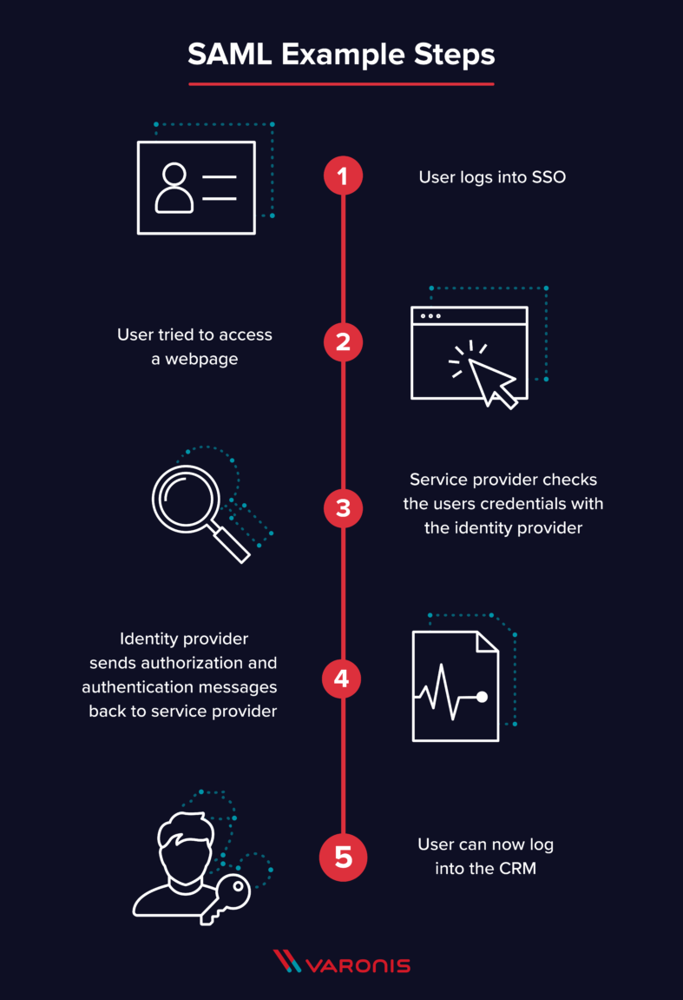
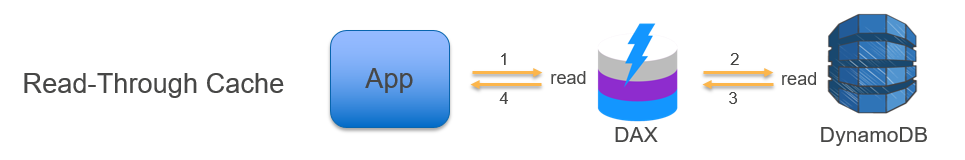

ASG
===

Scaling based on a schedule allows you to scale your application in response to predictable load changes.  
ex) Every week the traffic to your web application starts to increase on Wednesday, remains high on Thursday, and starts to decrease on Friday. 
You can plan your scaling activities based on the predictable traffic patterns of your web application.

To configure your ASG to scale based on a schedule, you create a scheduled action. The scheduled action tells Amazon EC2 Auto Scaling to perform a scaling action at specified times.

You can create scheduled actions for scaling one time only or for scaling on a recurring schedule.

IAM
===
You can authenticate to your DB instance using AWS Identity and Access Management(IAM) database authentication. IAM database authentication works with MySQL and PostgreSQL. With this authentication method, you don't need to use a password when you connect to a DB instance. Instead, you use an authentication token.  

An authentication token is a unique string of characters that Amazon RDS generates on request. Authentication tokens are generated using AWS Signature Version 4. Each token has a lifetime of 15 minutes. You don't need to store user credentials in the database, because authentication is managed externally using IAM. You can also still use standard database authenticaiton.

IAM database authentication provides the following benefits:
    1. Network traffic to and from database is encrypted using Secure Sockets Layer(SSL).
    2. You can use IAM to centrally manage access to your database resources, instead of managing access individually on each DB instance.
    3. For applications running on Amazon EC2, you can use profile credentials specific to your EC2 instance to access your database instead of a password, for greater security.

Security Group
===
A _security group_ acts as a virtual firewall for your instance to control inbound and outbound traffic. When you launch an instance in a VPC, you can assign up to five security groups to the instance. Security groups act at the instance level, not the subnet level. Therefore, each instance in a subnet in your VPC could be assigned to a different set of security groups. If you don't specify a particular group at launch time, the instance is automatically assigned to the default security group for the VPC.
When you add or remove rules, those changes are automatically applied to all instances to which you've assigned the security group. 

Best way to  encrypt sensitive environment variables like API credentials or storing sensitive database that Lambda function has
===
- Create a new KMS key and use it to enable encryption helpers that leverage on AWS Key Management Service to store and encrypt the sensitive information.
- When you create or update Lambda functions that use environment variables, AWS Lambda encrypts them using the AWS Key Management Service. When your Lambda function is invoked, environment variables of Lambda are decrypted and made available to the Lambda code.
- The first time you create or update Lambda functions that use environment variables in a region, a default service key is created for you automatically within AWS KMS. This key is used to encrypt environment variables after your Lambda function is created, you must create your own AWS KMS key and choose it instead of the default key. The default key will give errors when chosen. Creating your own key gives you more flexibility, including the ability to create, rotate, disable, and define access controls, and to audit the encryption keys used to protect your data.
- Lambda does not encrypt environment variables by default during the deployment process. When you deploy your Lambda function, all the environment variables you've specified are encrypted by default after, but not during, the development process.

Lambda@Edge
===
- Lets you run Lambda functions to customize content that CloudFront delivers, executing the functions in AWS locations closer to the viewer. The functions run in response to CloudFront events, without provisioning or managing servers.  
- You can use Lambda functions to change CloudFront requests and responses at the following points:

    - After CloudFront receives a request from a viewer (viewer request)
    - Before CloudFront forwards the request to the origin (origin request)
    - After CloudFront receives the response from the origin (origin response)
    - Before CloudFront forwards the response to the viewer (viwer response)
- You can automate your serverless application's release process using AWS CodePipeline and AWS CodeDeploy.
- Lambda will automatically track the behavior of your Lambda function invocations and provide feedback that you can monitor. In addition, it provides metrics that allows you to analyze the full function invocation spectrum, including event source integration and whether downstream resources perform as expected.

## Bring on-premises network to AWS
- You can bring part or all of your public IPv4 address range from your on-premises network to your AWS account. You continue to own the address range, but AWS advertises it on the internet. After you bring the address range to AWS, it appears in your account as an address pool. You can create an Elastic IP address from your address pool and use it with your AWS resources, such as EC2 instances, NAT gateways, and Network Load Balancers. This is also called "`Bring Your Own IP Addresses (BYOIP)`".
- To ensure that only you can bring your address range to your AWS account, you must authorize Amazon to advertise the address range and provide proof that you own the address range.
- A __Route Origin Authorization (ROA)__ is a document that you can create through your Regional Internet Registry (RIR), such as the American Registry for Internet Numbers (ARIN) or Réseaux IP Européens Network Coordination Centre (RIPE). It contains the address range, the ASNs that are allowed to advertise the address range, any an expiration date
- The ROA authorizes Amazon to advertise an address range under a specific AS number. However, it does not authorize your AWS account to bring the address range to AWS. To authorize your AWS account to bring an address range to AWS, you must publish a self-signed X509 certificate in the RDAP remarks for the address range. The certificate contains a public key, which AWS uses to verify the authorization-context signature that you provide. You should keep your private key secure and use it to sign the authorization-context message.

S3 Storage Classes
===
- S3 Standard: General purpose
- S3 Intelligent-Tiering: Unknown or chaning access
- S3 Standard-Infrequent Access (S3 Standard-IA): Infrequent access
- S3 Zone-Infrequent Access (S3 One Zone-IA): Infrequent access, non-critical data
- S3 Glacier: Archive
- S3 Glacier Deep Archive: Archive, lowest-cost 

S3 Intelligent-Tiering
===

- a New Amazon S3 Storage Class designed for customers who want to optimize storage costs automatically when data access patterns change, without performance impact or operational overhead. S3 Intelligent-Tiering is the first cloud object storage class that delivers automatic cost savings by moving data between two access tiers --frequent access and infrequent access-- when access pattern change, and is ideal for data with unknown or changing access patterns.
- S3 Intelligent-Tiering stores objects in two access tiers:
    -  one tier that is optimized for frequent access and another lower-cost tier that is optimized for infrequent access.
    - For a small monthly monitoring and automation fee per object, S3 Intelligent-Tiering monitors access patterns and moves objects that have not been accessed for 30 consecutive days to the infrequent access tier. There are no retrieval fees in S3 Intelligent-Tiering.
    - If an object inthe infrequent access tier is accessed later, it is automatically moved back to the frequent access tier. No additional tiering fees apply when objects are moved between access tiers within the S3 Intelligent-Tiering storage class. S3 Intelligent-Tiering is designed for 99.9% availability and 99.999999999% durability, and offers the same low latency and high throughput performance of S3 Standard.
- Amazon S3 features including S3 Object Tagging, S3 Cross-Region Replication, and S3 Select all work with S3 Intelligent-Tiering. Customers can start using S3 Intelligent-Tiering through the S3 API, CLI, and management console by putting objects directly into S3 Intelligent-Tiering or by using a S3 Lifecycle policy to move objects from S3 Standard or S3 Standard-IA to S3 Intelligent-Tiering. Customers can also archive obejcts with a S3 Lifecycle policy from S3 Intelligent-Tiering into Amazon S3 Glacier.
- S3 Intelligent-Tiering charges a small tiering fee and has a minimum eligible object size of 128KB for auto-tiering. Smaller objests may be stored but will always be charged at the Frequent Access tier rates.

## how to ensure data security
- You can secure the privacy of your data in AWS, both at rest and in-transit, through encryption.
- If your data is stored in EBS volume, you can enable EBS Encryption.
- If it is stored on Amazon S3, you can enable client-side and server-side encryption.
※ There is no such thing as On-Premises Data Encryption for S3 and EBS as these services are in the AWS cloud and not on your on-premises network.

## HVM AMI
- is required to take advantage of enhanced networking and GPU processing. 
- In order to pass through instructions to specialized network and GPU devices, the OS needs to be able to have access to the native hardware platform which the HVM virtualization provides.
- Although the enhanced networking feature can provide higher I/O performance and lower CPU utilization to your EC2 instance, you have to use an HVM AMI instead of PV AMI.

## How to increase the write performance of the database hosted in an EC2 instance.
- You can achieve this by either setting up a standard RAID 0 configuration or simply by increasing the size of the EC2 instance.
- Some EC2 instance types can drive more I/O throughput than what you can provision for a single EBS volume. You can join multiple gp2, io1, st1, or sc1 volumes together in a RAID 0 configuration to use the available bandwidth for these instances.

## Redundant Array of Inexpensive Disks (RAID)
- 여러 개의 디스크를 배열하여 속도의 증대, 안정성의 증대, 효율성, 가용성의 증대를 하는데 쓰이는 기술
- 종류와 구성방식
    - RAID 0
        - Concatenate 방식: 두개 이상의 디스크에 데이터를 순차적으로 쓰는 방법
        - Stripe 방식: 두개 이상의 디스크에 데이터를 랜덤하게 쓰는 방법
        - more suitable option for providing faster read and write operations, compared with RAID 1
    - RAID 1 (Mirror)
        - 볼륨 내의 패리티를 사용하지 않고 디스크에 같은 데이터를 중복 기록하여 데이터를 보존하게 되며, 적어도 동일한 용량의 디스크가 두 개가 필요.
        - provide mirroring redundancy, and fault-tolerance
    - RAID 2
        - RAID 0처럼 striping 방식이지만 에러 체크와 수정을 할 수 있도록 Hamming code를 사용하고 있는 것이 특징
        - 하드 디스크에서 ECC(Error Correction Code)를 지원하지 않기 때문에 ECC를 별도의 드라이브에 저장하는 방식으로 처리
        - 하지만 ECC를 위한 드라이브가 손상될 경우는 문제가 발생할 수 있으며 패리티 정보를 하나의 하드 드라이브에 저장하는 RAID 4가 나오면서 거의 사용되지 않는 방식
    - RAID 3, 4
        - RAID 0, 1의 문제점을 보완하기 위한 방식으로 3, 4로 나뉘긴 하지만 구성 방식은 거의 같다. RAID 3, 4는 기본적으로 RAID 0과 같은 striping 구성을 하고 있어 성능을 보완하고 디스크 용량을 온전히 사용할 수 있게 해주는데 여기에 추가로 에러 체크 및 수정을 위해서 패리티 정보를 별도의 디스크에 따로 저장
        - RAID 3은 데이터를 바이트 단위로 나누어 디스크에 동등하게 분산 기록, RAID 4는 데이터를 블록 단위로 나눠 기록하므로 완벽하게 동일하진 않다는 차이가 있다.
        - RAID 3은 드라이브 동기화가 필수적이라 많이 사용되지 않고 RAID 4를 더 많이 쓴다
    - RAID 5
        - RAID 3, 4에서 별도의 패리티 정보 디스크를 사용함으로써 발생하는 문제점을 보완하는 방식으로 패리티 정보를 stripe로 구성된 디스크 내에서 처리하게 만듦.
        - 만약 1개의 하드가 고장나더라도 남은 하드들을 통해 데이터를 복구 할 수 있다는 장점
    - RAID 6
        - RAID 5와 같은 개념이지만 다른 드라이브들 간에 분포되어 있는 2차 패리티 정보를 넣어 2개의 하드에 문제가 생겨도 복구할 수 있게 설계되었으므로 RAID 5보다 더욱 데이터의 안전성을 고려하는 시스템에서 사용.

## Amazon HSM 
- a cloud-based hardware security module (HSM) that enables you to easily generate and use your own encryption keys on the AWS Cloud.
- With CloudHSM, you can manage your own encryption keys using FIPS 140-2 Level 3 validated HSMs.

## Amazon KMS (Key Management Service)

## OLAP (Online Analytical Processing)
- Amazon Redshift, etc
## OLTP (Online Transaction Processing)
- RDS and DynamoDB

## Amazon Redshift
- Fully managed, __petabyte-scale data warehouse__ service
- extends data warehouse queries to your data lake. You can run analytic queries against petabytes of data stored locally in Redshift, and directly against exabytes of data stored in S3.
- is an OLAP type of DB
- currently, only supports Single-AZ deployments.
- Feature
    - uses **columnar storage**, data compression, and zone maps to reduce the amount of I/O needed to perform queries.
    - uses a **massively parallel processing** data warehouse architecture to parallelize and distribute SQL operations.
    - uses machine learning to deliver high throughout based on your workloads.
    - uses **result caching** to deliver sub-second response times for repeat queries.
    - automatically and continuously backs up your data to S3. It can asynchronously replicate your snapshots to S3 in another region for disaster recovery.
- components
    - Cluster
    - Redshift Nodes
    - Parameter Groups
        - a group of parameters that apply to all of the databases that you create in the cluster. The default paramter group has preset values for each of its paramters, and it cannot be modified.
- Database Querying Options
    - Connect to your cluster and run queries on the AWS Management Console with the Query Editor
    - Connect to your cluster through a SQL client tool using standard ODBC and JDBC connections.
- **Enhanced VPC Routing**
    - By using Enhanced VPC Routing, you can use VPC features, such as VPC security groups, network access control lists (ACLs), VPC endpoints, VPC endpoint policies, internet gateway, and Domain Name System (DNS) servers, to manage the flow of data between your cluster and other resources.
    - You can also use VPC flow logs to monitor __COPY__ and __UNLOAD__ traffic.
        - When you use Amazon Redshift Enhanced VPC Routing, Amazon Redshift forces all COPY and UNLOAD traffic between your cluster and your data repositories through your Amazon VPC.
    - If Enhanced VPC Routing is not enabled, Amazon Redshift routes traffic through the Internet, including traffic to other services within the AWS network.
- **RedShift Spectrum**
    - Enables you to run queries against exabytes of data in S3 **without having to load or transform any data**.
        - enabled you to query and analyze all of your data in Amazon S3 using the open formats you already use, with no data loading or transformations needed.
    - Redshift Spectrum doesn't use Enhanced VPC Routing
    - If you store data in a columnar format, Redshift Spectrum scans only the columns needed by your query, rather than processing entire rows.
    - If you compress your data using one of Redshift Spectrum's supported compression algorithms, less data is scaned.

## EFS

- Amazon Elastic File System (EFS) provides simple, scalable, elastic file storage for use with AWS Cloud services and on-premises resources.
- When mounted on Amazon EC2 instances, an Amazon EFS file system provides a standard file system interface and file system access semantics, allowing you to seamlessly integrate Amazon EFS with your existing applications and tools.
- Multiple Amazon EC2 instances can acess an Amazon EFS at the same time, allowing Amazon EFS to provide a common data source for workloads and applications running on more than one Amazon EC2 instance.
- Example: there is a fleet of On-Demand EC2 instances that stores file doucments from the users to one of the attached EBS volumes. 
    - Problem: The system performance is quite slow because the architecture doesn't provide the EC2 instances a parellel shared access to the file documents.
    - Solution: Remember that an EBS volume can be attached to one EC2 instance at a time, hence, no ther EC2 instance can connect to that EBS Provisioned IOPS volume. Take note as well that the type of storage needed here is a "file storage" which means that S3 is not the best service to use because it is mainly used for "object storage", and S3 does not provide the notion of "folders" too.
    ※ ElastiCache is an in-memory data store that improves the performance of your applications, which is not what you need since it is not a file storage.

## CloudTrail

- service that enables governance, compliance, operational auditing, and risk auditing of your AWS account. With CloudTrail, you can log, continuously monitor, and retain account activity related to actions across your AWS infrastructures.
- provides event history of your AWS account acivitiy, including actions taken through the AWS Management Console, AWS SDKs, command line tools, API calls, and other AWS services. This event history simplifies security analysis, resource change tracking, and troubleshooting.
- although CloudWatch is also monitoring service, it cannot track the API calls to your AWS resources.

## AWS X-Ray
- helps you debug and analyze your microservices applications with request tracing so you can find the root cause of issues and performance.

## Terminology
- SIT: System Integration Testing, is part of Functional Testing
- UAT: User Acceptance Testing, is part of Functional Testing
- DEV: development
- PROD : production

## Amazon Athena
- a service that enables a data analyst to perform interactive queries in the AWS on data stored in Amazon S3.
- Athena is a serverless query service, an analyst doesn't need to manage any underlying compute infrastructure to use it.
- There is also no need to load S3 data into Amazon S3 or transform it for analysis, which makes it easier and faster for an analyst to gain insight

## ephemeral store volume
- `ephmeral` literally means "short-lived" or "temporary" in the English dictionary.Hence, when you see this word in AWS, always consider this as just a temporary memory or a short-lived storage.
- The virtual devices for instance store volumes are named as `ephemeral[0-23]`. Instance types that support one instance store volumes have `ephemeral0`. Instance types that support two instance store volumes have `ephemeral0` and `ephemeral1`, and so on until `ephemeral23`.
- The data in an instance store persists only during the lifetime of its associated instance. If an instance reboots (intentionally or unintentionally), dat in the instance store persists.
- However, data in the instance store is lost under the following circumstances:
    - The underlying disk drive fails
    - The instance stops
    - The instance terminates
- instance store volumes and EBS volumes are two different storage types. 
    - An Amazon EBS volume is a durable, block-level storage device that you can attach to a single EC2 instance. 
    - An instance store provides temporary block-level storage and is located on disks taht are physically attached to the host computer. No automatic backup will be performed

## Storages that EC2 offers
- Amazon Elastic Block Store(EBS)
- Amazon EC2 Instance Store: ephemeral
- Amazon Elastic File System(EFS)
- Amazon Simple Storage Service(S3)

## RDS Mornitoring
- Amazon RDS provides metrics in real time for the operating system (OS) that your DB instance runs on.
- You can view the metrics for your DB instance using the console, or consume the Enhanced Mornitoring JSON output from the CloudWatch Logs in a mornitoring system of your choice.
- By default, Enhanced Monitoring metrics are stored in the CloudWatch Logs for 30 days. To modify the amount of time the metrics are stored in the CloudWatch Logs, change the retention for the `RDSOSMetrics` log group in the CloudWatch console.
- Certain differences between CloudWatch and Enhanced Monitoring Metrics
    - CloudWatch gathers metrics about CPU utilization from the hypervisor for a DB instance
    - Enhanced Monitoring gathers its metrics from an agent on the instance.
    - Because of difference of the measurements, the hypervisor layer performs a small amount of work.
        - Hence, when you need to closely monitor how the different processes or threads on a DB instance use the CPU, including the percentage of the CPU bandwidth and total memory consumed by each process to maintain the reliability, availability, and performance of your system, the most suitable solution to properly monitor databases is to enable Enhanced Monitoring in RDS.
            - Although you can use Amazon CloudWatch to monitor the CPU Utilization of your db instance, it does not provide the percentage of the CPU bandwidth and total memory consumed by each database process in your RDS instance.
            - CloudWatch gathers metrics about CPU utilization from the hypervisor for a DB instance while RDS Enhanced Monitoring gathers its metrics from an agent on the instance.
            - You do not have direct access to the instances/servers of your RDS database instance, unlike with your EC2 instances where you can install a CloudWatch agent or a custom script to get CPU and memory utilization of your instance.
        - The differences can be greater if your DB instances use smaller instance classes, because then there are likely more virtual machines(VMs) that are managed by the hypervisor layer on a single physical instance. Enhanced Monitoring metrics are useful when you want to see how different processes or threads on a DB instance use the CPU.

## Amazon EMR
- Amazon EMR provides you a managed Hadoop framework that makes it easy, fast, and cost-effective to process vast amounts of data across dynamically scalable Amazon EC2 instances.
- You can access the operating system of these EC2 instances that were created by Amazon EMR.

## SSH Connection and CIDR block
- SSH protocol uses TCP and port 22.
- __/32__ denotes one IP address
- __/0__ refers to the entire network

## Relation between ASG and ELB health checks
- There are two ways of checking the status of your EC2 instances:
    - via the ASG
    - via ELB health checks
- ASG
    - The default health checks for an ASG are __EC2 status checks__ only.
    - If an instance fails these status checks, the ASG considers the intance unhealthy and replaces.
    - __If you attached one or more load balancers or target groups to your ASG, the group does not, by default, consider an instance unhealthy and replace it if it fails the load balancer health checks.__
    - __However, you can optionally configure the ASG to use ELB health checks, it considers the instance unhealthy if it fails either the EC2 status checks or the load balancer health checks.__ This ensures that the group can determine an instances's health based on additional tests provided by the load balancer. The load balancer periodically sends pings, attempts connections, or sends requests to test the EC2 instances. These tests are called __health checks__.

## Temporary credentials in AWS
- Temporary credentials are useful in scenarios that involve identity federation, delegation, cross-account, and IAM roles.
- Example scenario: all 1200 employees would be granted access to use Amazon S3 for storage of their personal documents. And also it is required to incorporates single sign-on feature from your corporate AD or LDAP directory and also restrics access for each individual user to a designated user folder in an S3 bucket
    - In this example, it is called __enterprise identity federation__ considering that you also need to set up sigle sign-on (SSO) capability.
    - suitable solution:
        - to set up a Federation proxy or an Identity provider
        - to set up an AWS Security Token Service(AWS STS) to generate temporary tokens
        - to configure an IAM role

- In an enterprise identity federation, you can authenticate users in your organization's network, and then provide those users access to AWS without creating new AWS identities for them and requiring them to sign in with a seperate user name and password. This is known as the _single sign-on_ (SSO) approach to temporary access. AWS STS supports opend standards like Security Assertion Markup Language (SAML) 2.0, with which you can use Microsoft ADFS to leverage your Microsoft Active Directory. You can also use SAML 2.0 to manage your own solution for federating user identities.

## SAML

- Security Assertion Markup Language (SAML) is an open standard that allows identity providers(IdP) to pass authorization credentials to service providers (SP), which means that you can use one set of credentials to log into many different websites.
- SAML transactions use Extensible Markup Language (XML) for standardized communcations between the IdP and SP. SAML is the link between the authentication of a user's identity and the authorization to use a service.
- SAML enables Single Sign-On (SSO), a term that means users can log in once, and those same credentials can be reused to log into other service providers.
- compose
    - Identity Provider (IdP)
    - Service Provider (SP)
- SAML Assertion
    - XML document that the identity provider sends to the service provider that contians the user authorization
    - There are three different types of SAML Assertion
        - Authentication assertions: prove identification of the user and provide the time the user logged in and what method of authentication they used(i.e. Kerberos, two-factor, etc)
        - Attribution assertions: passes the SAML attributes to the service provider - SAML attributes are specific pieces of data that provide information about the user
        - Authorization assertions: says if the user is authorized to use the service or if the identify provider denied their request due to a password failure or lack of rights to the service
- SAML vs OAuth
    - OAuth is a slightly newer standard that was co-developed by Google and Twitter to enable streamlined internet logins.
    - OAuth uses a similar methodology as SAML to share login information.
    - SAML provides more control to enterprises to keep their SSo logins more secure, whereas OAuth is better on mobile and uses JSON

## Distributed Messaging System
- Three main parts
    - components of your distributed system(EC2 instances)
    - your queue (distributed on Amazon SQS servers)
    - messages in the queue
- You can set up a system which has several components that send messages to the queue and receive messages from the queue. The queue redundantly stores the messages across multiple Amazon SQS servers.

- Refer to the third step of the SQS Message Lifecycle:
    1. Components 1 sends Message A to a queue, and the message is distributed across the Amazon SQS servers redundantly.
    2. When Component 2 is ready to process a message, it consumes messages from the queue, and Message A is returned. While Message A is being processed, it remains in the queue and isn't returned to subsequent receive requests for the duration of the visibility timeout.
    3. Component 2 __deletes__ Message A from the queue to prevent the message from being received and processed again once the visibility timeout expires.
- Always remember that the messages in the SQS queue will continue to exist even after the EC2 instance has processed it, until you delete that message. You have to ensure that you delete the message after processing to prevent the message from being received and processed again once the visibility timeout expires.

## WLM
- WorkLoad Management
- When you create a paramter group, the default WLM configuration contains one queue that can run up to five queries concurrently. You can add additional queues and configure WLM properties in each of them if you want more control over query processing. Each queue that you add has the same default WLM configuration until you configure its properties. When you add additional queues, the last queue in the configuration is the _default queue_. Unless a query is routed to another queue based on criteria in the WLM configuration, it is processed by the default queue. You cannot specify user groups or query groups for the default queue.

## Amazon EBS Encryption
- Amazon EBS encryption offers a simple encryption solution for your EBS volumes without the need to build, maintain, and secure your own key management infrastructure.
- When ou create an encrypted EBS volume and attach it to a supported instance type, the following types of data are encrypted:
    - Data at rest inside the volume
    - All data moving between the volume and the instance
    - All snapshots created from the volume
    - All volumes created from those snapshots
- If a EBS volume attached to the instance is already unencrypted, the best way to encrypt the data is to create and mount a new, encrypted Amazon EBS volume. Then, move the data to the new volume and finally delte the old, unencrypted Amazon EBS volume.
    - You cannot encrypt the volume even if you unmount the volume. Remember taht encryption has to be done during volume creation.
    - You cannot create an encrypted snapshots of an unencrypted volume or change existing volume from unencrypted to encrypted. You have to create new encrypted volume and transfer data to the new volume.

## DynamoDB
- NoSQL database service that provides fast and predictable performance with seamless scalability.
- offers encryption at rest.
- You can create database tables that can store and retrieve any amount of data, and serve any level of request traffic.
- You can scale up or scale down your tables' throughput capacity without downtime or performance degradation, and use the AWS Management Console to monitor resource utilization and performance metrics.
- Provides on-demand backup capability as well as enable point-in-time recovery for your DynamoDB tables. With point-in-time recovery, you can restore that table to any point in time during the **last 35 days**.
- All of your data is stored in partitions, backed by solid state disks (SSDs) and automatically replicated across multiple AZs in an AWS region, providing built-in high availability and data durability.
- You can create tables that are automcatically replicated across two or more AWS Regions, with full support for multi-master writes.
- Core Components
    - Tables
    - Items
    - Attributes
    - Primary Key
    - Secondary Indexes
    - **DynamoDB Streams**: 
        
        - optional feature not default. You need to manually enable DynamoDB Streams.
        - an ordered flow of information about changes to items in an Amazon DynamoDB table. When you enable a stream on a table, DynamoDB captures information about every modification to data items in the tables.
        - The naming convention for DynamoDB Streams endpoints is __streams.dynamodb..amazonaws.com__
        - Whenever an application creates, updates, or deletes items in the table, DynamoDB Streams writes a __stream record__ with the primary key attributes of the items that were modified. A *stream record* contains information about a data modification to a single item in a DynamoDB table. You can configure the stream so that the stream records capture additional information, such as the "before" and "after" images of modified items.
            - A new item is added to the table: captures an image of the entire item, including all of its attributes
            - An item is updated: captures the "before" and "after" image of any attributes that were modified in the item.
            - An item is deleted from the table: captues an image of the entire item before it was deleted.
        - Each stream record also contains the name of the table, the event timestamp, and other metadata.
        - Stream records are organized into groups, or **shards**. Each shard acts as a container for muliple stream records, and contains information required for accessing and iterating through these records.
        - Stream records have a lifetime of 24 hours; after that, they are automatically removed from the stream.
        - You can use DynamoDB Streams together with AWS Lambda to create a _trigger_, which is a code that executes automatically whenever an event of interest appears in a stream. With triggers, you can build applications that react to data modification in DynamoDB tables.
            
            - If you enable DynamoDb Streams on a table, you can associate the stream ARN with a Lambda function that you write. Immediately after an item in the table is modified, a new record appears in the table's stream. AWS Lambda polls the stream and invokes your Lambda function synchronously when it detects new stream rocords. The Lambda function can perform any actions you specify, such as sending a notification or initiating a workflow.
        - DynamoDB Streams enables powerful solutions such as data replication within and across Regions, materialized views of data in DynamoDB tables, data analysis using Kinesis materialized view, and much more.

## Amazon DynamoDB Accelerator (DAX)

- a fully managed, highly available, in-memory cache that can reduce Amazon DynamoDB response times from milliseconds to microseconds, even at millions of requests per second.
- Although you may use ElasticCache as your database cache, it will not reduve the DynamoDB response time from milliseconds to microseconds as compared with DynamoDB DAX.
- With Amazon EBS, you can use any of the standard RAID configurations that you can use with a traditional bare metal server, as long as that particular RAID configuration is supported by the operating system for your instance. This is because all RAID is accomplished at the software level. For greater I/O performance than you can achieve with a single volume, RAID 0 can stripe multiple volumes together; for on-instance redundancy, RAID 1 can mirror two volumes together.

## TCO
- total cost of onwership
- IT 용어 <컴퓨터> 소유 총비용
## LDAP
- lightweight directory access protocol
- 경량 디렉토리 액세스 프로토콜(디렉토리 목록, 떄로는 인터넷에 엑세스할 때 사용하는 간단한 프로토콜)