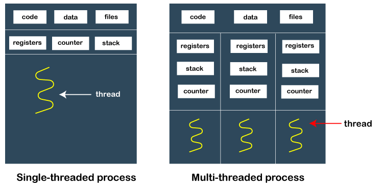

Thread
---

  
- Light Weight Process
- multi threads in single process
    - 프로세스 안에 여러 쓰레드를 품고 있으므로 프로세스의 데이터에 모두 접근 가능
        - 프로세스안에 STACK, HEAP, BSS, DATA, CODE의 구조 안에서 쓰레드는 자신만의 별도의 STACK 영역을 갖고 나머지 부모 프로세스의 HEAP, BSS, DATA, CODE를 모두 공유
    - 프로세스 간에는 IPC와 같은 특별한 기법 없이는 서로의 데이터에 접근 불가
    - 동시 실행 가능

## Mutli Tasking vs Multi Processing vs Multi Thread

- Multi Tasking
    - 하나의 CPU에 여러 프로세스를 아주 빠른 작은 단위로 돌아가며 실행
- Multi Processing
    - 여러 CPU가 하나 또는 여러 프로세스를 서로 나눠 병렬 실행하여 속도를 높임.
    - 어떻게 하나의 프로세스를 여러 CPU가 처리 가능하도록 할까?
        - CPU에 여러 쓰레드를 만들면 가능
        - 최근 CPU는 멀티 코어를 가지므로 Thread를 여럿 만들어 멀티 코어 활용도 높임. 실행속도 UP

## Thread 장점
1. 사용자에 대한 응답성 향상
    - ex. Process -> two threads: One executes certain task, the other communicates with users.
2. 자원 효율
    - 자원 공유 효율:
        - 쓰레드는 하나의 프로세스 안에서 자원 공유
    - 자원 효율:
        - 1개의 프로세스가 4GB의 자원이 할당 된다면 6개의 프로세스라면 24GB가 필요할 것.
        - 하나의 프로세스에서 6개의 쓰레드를 활용한다면 필요한 자원은 4GB뿐.

## Thread 단점
1. 쓰레드 중 한 쓰레드만 문제가 있어도, 전체 프로세스가 영향을 받음
    - 멀티 쓰레드
        - 하나의 쓰레드 문제가 프로세스 전체로 영향이 미침.
    - 멀티 프로세스
        - 프로세스는 모두 분리 되어 있으므로 다른 프로세스에 영향 없음
2. 쓰레드를 많이 생성하면, Context Swithching이 많이 일어나 성능 저하.
    - ex. 리눅스에서는 쓰레드를 프로세스와 같이 다룸 => 쓰레드를 많이 생성하면, 모든 쓰레드를 스케줄링해야 하므로, Context Swithching이 빈번할 수 밖에 없음. => 적당한 수를 찾아야 함.

## Process vs Thread
- 프로세스 독립적, 쓰레드 프로세스의 서브셋
- 프로세스 각 독립적인 자원을 가짐, 쓰레드 프로세스 자원 공유
- 프로세스 자신만의 주소 영역, 쓰레드 주소영역 공유
- 프로세스간 IPC 기법으로 통신, 쓰레드 필요없음

## 쓰레드 동기화(Synchronization) 이슈
- Mutual exclusion (상호배제)
    - 여러 쓰레드가 변경하는 공유 변수에 대해 Exclusive Access 필요
    - 한 쓰레드가 공유 변수를 처리하는 동안 다른 쓰레드가 동시 접근하지 못하도록 블락킹
    - critical resource: 임계 자원. 상호배제가 이뤄져야할 자원/변수
    - critical section: 임계 영역. 상호배제가 이뤄져야할 코드의 구간
    - LOCKING 메커니즘
        - Mutext(binary semaphore): 임계 구역에 하나의 스레드만 들어갈 수 있음
        - Semaphore: 임계 구역에 여러 스레드가 들어갈 수 있음. 카운터를 두어서 동시에 리소스에 접근할 수 있는 허용 가능한 스레드 수를 제어

## 교착상태(Deadlock)와 기아상태(Starvation)
- Deadlock
    - 무한 대기 상태: 두 개 이상의 작업이 서로 상대방의 작업이 끝나기만을 기다리고 있기 때문에, 다음 단계로 진행 X
- Starvation
    - 프로세스의 우선순위가 낮아 원하는 자원을 계속 할당 받지 뮷하는 상태
    - 교착 상태는 여러 프로세스가 **동일 자원** 점유를 요청할 때 발생
    - 기아상태는 여러 프로세스가 **부족한 자원**을 점유하기 위해 경쟁할 때, 특정 프로세스는 영원히 자원 할당이 안되는 경우