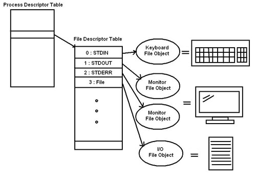

extra
================================

# Pipeline(|)
유닉스/리눅스 시스템에서 왼쪽의 명령어의 출력을 오른쪽 명령어의 입력으로 보내는 역할을 한다

# file descriptor와 redirection(>, >>, <, <<)
파일 디스크립터: 리눅스 시스템에서 모든 것은 파일로 이루어진다. ㅇ리반적인 파일에서부터 디렉토리, 소켓, 파이프, 블록 디바이스, 캐릭터 디바이스 등 모든 객체는 파일로 관리된다.
redirection: 표준 입출력의 방향을 바꿔주는 역할을 한다. 표준 입력은 키보드, 표준 출력은 모니터이지만 리다이랙션을 사용해 파일로 처리할 수 있다.

# semicolon(;)
두 개 이상의 명령을 이어서 실행할 때 사용
yum -y update;shutdown -r now #업데이트 후 재시작