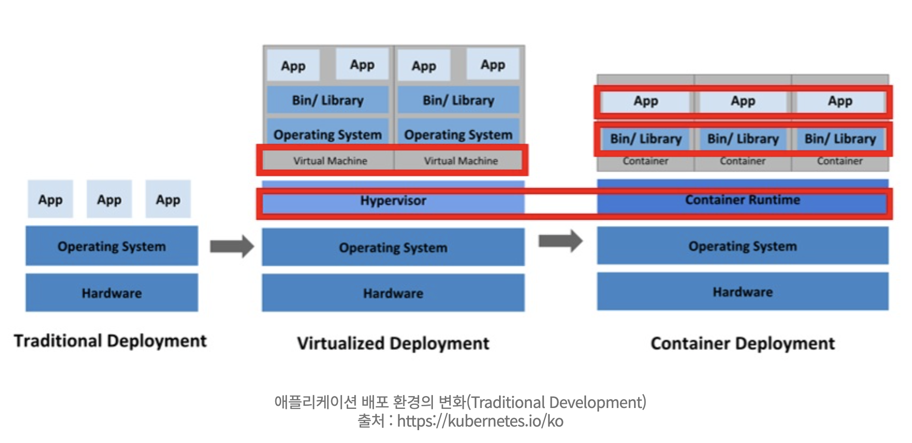

# 도커와 쿠버네티스

## 용어
- 컨테이너: 앱이 구동되는 환경까지 감싸서 실행할 수 있도록 하는 격리 기술
- 컨테이너 런타임: 컨테이너를 다루는 도구 ex) 도커
- 오케스트레이션: 여러 서버에 걸친 컨테이너 및 사용하는 환경 설정을 관리하는 행위
- 쿠버네티스(k8s): 컨테이너 런타임을 통해 컨테이너화된 애플리케이션을 오케스트레이션 하는 도구

## 전통 vs 가상머신 vs 컨테이너 구조 비교

- 전통적 배포
    - 물리적 하나의 컴퓨터에 하나의 OS를 깔고 여러 프로그램을 설치하는 방식
    - 마치 일반 유저가 PC에 여러가지 프로그램을 설치하여 사용하는 것과 같다.
- 가상화 배포
    - 가상 머신을 기반으로 배포를 하는 방법으로, OS 위에 하이퍼바이저(하나의 시스템 상에서 가상 컴퓨터를 여럿 구동할 수 있도록 해주는 중간 계층)가 위치하며, 각각의 가상머신 위에 개별적으로 OS와 Bin/Library가 포함되어 프로그램이 실행되기 위한 환경을 제공.
    - 가상 머신 위에서 CPU, Mem, 저장 장치 등 개별적으로 할당되며 서로 다른 VM에서 돌아가는 프로그램은 서로 간섭 X
    - 다만 가상머신은 하나의 논리적 완전한 컴퓨터이고 일일이 OS를 설치해야하기 때문에 많은 컴퓨터 리소스와 컨테이너 방식에 비해 무거운 편.
- 컨테이너화 배포
    - 컨테이너는 가상 머신과 달리 프로그램 구동을 위해 개별 OS가 필요하지 않다. 전통방식과 동일하게 Host PC의 OS만을 요구하는데, 여기서 중요한 차이가 있음.
    - 각각의 프로그램들은 각각 실행되면서 '이 컴퓨터에서 나만 구동되고 있다'라고 판단할 수 있도록, 각 프로그램 간에 간섭을 일으킬 수 없는 장벽을 친다. 이와 같은 장벽을 치는 것은 동시에 OS는 각 프로그램이 사용할 수 있는 CPU, 메모리 등의 자원 또한 독립적으로 사용할 수 있도록 할당 및 관리. 이 과정을 통해 각 프로그램들은 '서로 다른 컴퓨터에서 동작한다'고 생각하게 된다. 이와 같은 컨테이너 동작 방식을 `OS 커널을 공유하는 가상화`라고 표현하기도 한다.
    - 컨테이너는 OS를 공유하는 방식이기 때문에, 각 프로그램의 문제가 다른 프로그램을 간섭할 수는 없지만, 만약 한 프로그램의 문제가 OS에 문제를 일으키는 경우, 해당 OS에서 구동 중인 전체 컨테이너에 영향을 줄 수 있다.

## 쿠버네티스 기능
- 자동화된 롤아웃과 롤백
- 스토리지 오케스트레이션
- 자동 bin packing
- IPv4/IPv6 이중 스택
- 자가 치유
- 서비스 디스커버리와 로드 밸런싱
- 시크릿과 구성 관리
- 배치 실행
- Horizontal 스케일링
- 확장성을 고려하여 설계됨